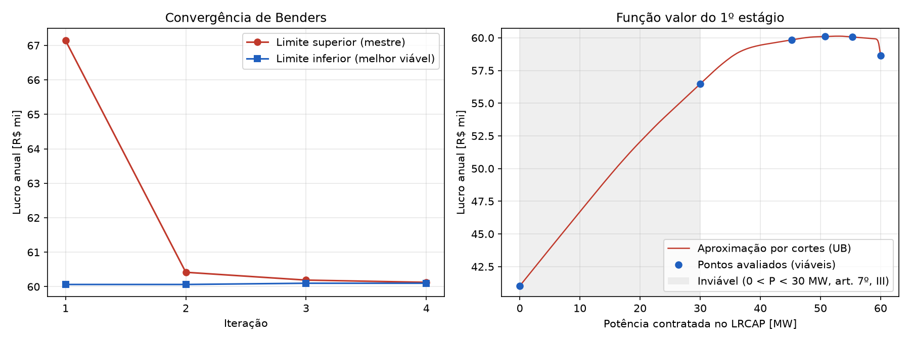
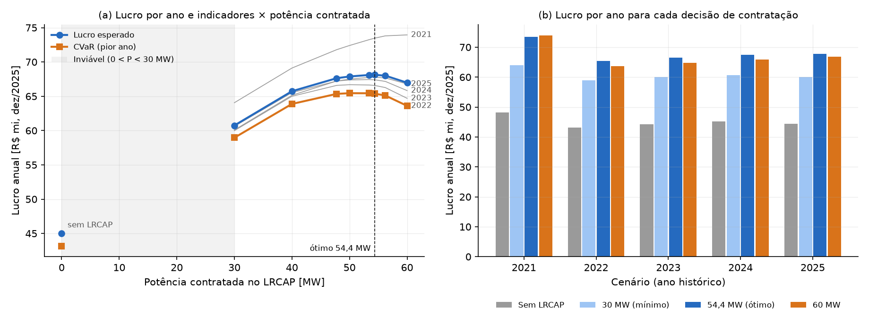
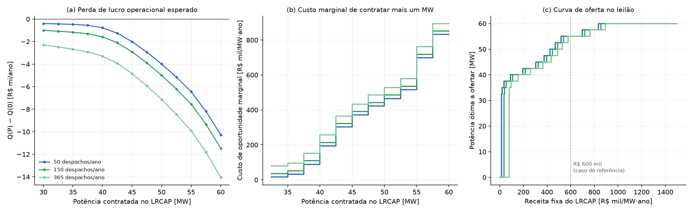

# Otimização da Operação de um Sistema Híbrido PV-BESS com Produção de Hidrogênio Verde

**Arbitragem entre o Leilão de Reserva de Capacidade (LRCAP) e o Mercado de Curto Prazo (MCP)**

Repositório do modelo de otimização da dissertação de mestrado. O modelo é um MILP
implementado em Python/[Pyomo](https://www.pyomo.org/) e resolvido com o
[HiGHS](https://highs.dev/) (gratuito e de código aberto).

```
 Lado mercantil (operado pelo empreendedor)
   PV ────────────┐
   BESS mercantil ◄┼─► Eletrolisador ─► Tanque H₂ ─► venda de H₂
                   └─► exportação ao MCP (PLD) ──┐
                                                 ├─► ponto de conexão compartilhado ◄─► SIN
 BESS módulo LRCAP ◄─► despacho do ONS ──────────┘   (receita fixa; energia liquidada na CONCAP)
```

As regras do LRCAP seguem a **Portaria Normativa MME nº 136/2026** (LRCAP de 2026 —
Armazenamento). O ponto central: a potência contratada é operada pelo ONS e não pode
gerar receita no MCP (art. 9º §5º, IV e §6º). Por isso a arbitragem é modelada como a
**divisão do BESS** entre um módulo LRCAP e um módulo mercantil. Detalhes em
`docs/formulacao.md`.

## Estrutura

```
config/caso_base.yaml      parâmetros do caso (valores PLACEHOLDER — substituir por dados reais)
config/itajuba_2025.yaml   mesmo caso com PLD SE/CO e PV de Itajubá (requer data/ gerado pelo importador)
config/unifei_escalonada.yaml  planta da UNIFEI (1 MWp + PEM 350 kW) escalonada a 50 MWp + 17,5 MW
docs/formulacao.md         formulação matemática completa (conjuntos, parâmetros, variáveis, restrições)
src/pvbess_h2/
  parametros.py            leitura/validação do YAML
  dados.py                 séries de entrada (PV, PLD, despacho do ONS) — reais via CSV ou sintéticas
  modelo.py                construção do modelo Pyomo e chamada do solver
  resultados.py            série horária de resultados, indicadores e gráfico
  importacao.py            leitura dos formatos da CCEE e do PVGIS
  decomposicao.py          Benders com cortes reforçados (P_cap no mestre, semanas nos subproblemas)
scripts/
  rodar_caso.py            resolve um caso e salva CSV + indicadores + gráfico em resultados/
  varredura_lrcap.py       sensibilidade: lucro × potência contratada no LRCAP
  importar_dados.py        converte CSVs brutos da CCEE (PLD) e do PVGIS (PV) para data/
  anual_benders.py         ano completo por decomposição de Benders (blocos semanais em paralelo)
  estocastico.py           programa estocástico com CVaR (anos históricos como cenários)
  vss_evpi.py              VSS e EVPI do programa estocástico
  curva_oferta.py          curva de oferta no LRCAP (contrato de H₂, importação, frequência de despacho)
tests/                     testes (modelo, importação de dados, decomposição)
```

## Como rodar

```bash
pip install -r requirements.txt
python scripts/rodar_caso.py                     # caso base (7 dias)
python scripts/varredura_lrcap.py --passos 11    # curva de arbitragem LRCAP x MCP
python scripts/anual_benders.py                  # ano completo de Itajubá (≈ 75 s em 4 núcleos)
python -m pytest                                 # testes
```

Para criar um novo cenário, copie `config/caso_base.yaml` (ex.: `config/cenario_h2_barato.yaml`),
altere os parâmetros e rode `python scripts/rodar_caso.py config/cenario_h2_barato.yaml`.
Os resultados vão para `resultados/<nome_do_cenario>/`.

### Usando dados reais — caso Itajubá (MG), submercado SE/CO

1. **PLD horário** — [dados abertos da CCEE](https://dadosabertos.ccee.org.br), conjunto
   "PLD horário": baixe o CSV do ano (ex.: 2025).
2. **Geração PV** — [PVGIS](https://re.jrc.ec.europa.eu/pvg_tools/pt/), aba *Dados horários*:
   lat. `-22.4256`, long. `-45.4528`, marque *Potência FV* com 1 kWp, perdas 14%,
   inclinação/azimute otimizados, último ano disponível; baixe em CSV.
3. Converta para o formato do modelo (o PV é reposicionado no ano do PLD e passado para UTC-3):

   ```bash
   python scripts/importar_dados.py --pld pld_horario_2025.csv --submercado SE \
       --pv Timeseries_-22.426_-45.453_*.csv --ano 2025
   python scripts/rodar_caso.py config/itajuba_2025.yaml
   ```

**Frequência do despacho do ONS.** Por padrão o módulo LRCAP é despachado todos os dias. Com
`lrcap.despacho_ons.ciclos_ano: N`, só os N dias de cada ano civil com maior PLD no período de
descarga são despachados (sistema mais apertado); nos demais, o módulo fica cheio e não recarrega.

Formatos aceitos diretamente pelo modelo (para outras fontes):
`timestamp,pld`, `timestamp,fator_capacidade` e, para o despacho do ONS,
`timestamp,descarga_pu,recarga_pu` (em `lrcap.despacho_ons.arquivo`).

## Resultados — Itajubá (MG), ano de 2025

PLD horário SE/CO de 2025 (CCEE), PV do PVGIS-ERA5 (50 MWp, fator de capacidade 16,9%),
BESS de 60 MW / 300 MWh, eletrolisador de 10 MW, despacho diário do ONS (descarga
18h–21h, recarga 10h–14h). **Parâmetros econômicos ainda provisórios** (receita fixa de
R\$ 600 mil/MW·ano; H₂ a R\$ 35/kg).

Ótimo anual por Benders (3 iterações, *gap* 0,04%): **P_cap = 50,8 MW**, lucro de
**R\$ 60,1 mi/ano**.



| Potência no LRCAP | Lucro anual | MCP | H₂ | Receita fixa |
|---|---|---|---|---|
| 0 MW | R\$ 41,0 mi | 0,9 | 43,8 | 0 |
| 30 MW (mínimo) | R\$ 56,5 mi | 0,7 | 43,6 | 18,0 |
| **50,8 MW (ótimo)** | **R\$ 60,1 mi** | 3,8 | 31,7 | 30,5 |
| 60 MW (BESS inteiro) | R\$ 58,6 mi | 6,5 | 21,5 | 36,0 |

- Participar do LRCAP aumenta o lucro em cerca de R\$ 19 mi/ano em relação a não participar.
- O ótimo é **plano** entre 45 e 55 MW (variação < 0,5%): a escolha exata depende mais dos
  parâmetros econômicos provisórios do que da operação.
- Semanas isoladas levam a ótimos de 35 a 56 MW. Por isso a decisão, que vale por 15 anos
  de contrato, precisa ser tomada sobre o ano inteiro.
- A troca central é **H₂ × receita fixa**: cada MW contratado tira bateria que alimentaria
  o eletrolisador à noite (fator de capacidade do eletrolisador: 0,57 no ótimo).

### Planta da UNIFEI escalonada

Proporção eletrolisador/FV da planta real (PEM NEA|Hytron de 350 kW para ~1 MWp = 0,35),
escalonada para 50 MWp e **17,5 MW** de eletrolisador (carga mínima de 10%, típica de PEM).
O BESS continua hipotético (a planta não tem bateria).

| Caso | Eletrolisador | P_cap ótimo | Lucro anual | H₂ produzido | FC do eletrolisador |
|---|---|---|---|---|---|
| `itajuba_2025` | 10 MW | 50,8 MW | R\$ 60,1 mi | 905 t | 0,57 |
| `unifei_escalonada` | 17,5 MW | **54,4 MW** | R\$ 67,5 mi | 1.117 t | 0,40 |

Com um eletrolisador maior, mais PV é convertido em H₂ **durante o dia**, sem passar pela
bateria. O módulo mercantil perde valor e o ótimo desloca mais potência para o LRCAP.
Pendências: catálogo do eletrolisador e geração medida da UFV.

### Sensibilidade: receita fixa do LRCAP × preço do H₂

Benders anual em 48 combinações (6 receitas fixas × 8 preços de H₂), caso `unifei_escalonada`
(`python scripts/mapa_sensibilidade.py`, ~56 min em 4 núcleos; *gap* máximo 0,11%).


Referências para a faixa de receita fixa (não há leilão anterior de baterias no Brasil):

| Receita fixa | Referência | Observação |
|---|---|---|
| R\$ 330 mil/MW·ano | 1º leilão MACSE (Itália, Terna, 30/09/2025): € 12.959/MWh·ano, baterias de lítio, 15 anos | Convertido para 4 h com PTAX de 30/09/2025 (R\$ 6,2396/€) = R\$ 323 mil |
| R\$ 830 mil/MW·ano | Leilão nº 3/2026-ANEEL (LRCAP, 20/03/2026): 501,3 MW de térmicas existentes a óleo e biodiesel, R\$ 831.251,52/MW·ano, deságio 50,1% | Piso: usinas existentes, sem investimento |
| R\$ 1,0 e 1,5 mi/MW·ano | CAPEX de referência de BESS da EPE (Caderno de Parâmetros de Custos, PDE 2035): R\$ 5.000–6.000/kW | Anualizado a 10% a.a. em 15 anos = R\$ 657–789 mil/MW·ano só de capital; os valores somam O&M, encargos e reposição (estimativa própria) |
| R\$ 2,33 mi/MW·ano | Leilão nº 2/2026-ANEEL (LRCAP, 18/03/2026): 18,97 GW de térmicas a gás, biometano e carvão e ampliações hidrelétricas, novas e existentes, R\$ 2,334 mi/MW·ano, deságio 5,5% | Teto: expansão térmica e hidrelétrica |

Fontes: boletins InfoLeilão Expresso da CCEE (04º e 05º LRCAP 2026), comunicado da Terna de
01/10/2025 e Caderno de Parâmetros de Custos MME/EPE (nov/2025). Detalhes e referências completas no
Quadro 4.1 de `docs/dissertacao/cap4_resultados.md`. A duração (h) associada ao CAPEX da EPE ainda
precisa ser conferida no documento original.

- Em **nenhuma** combinação compensa ficar fora do LRCAP: a potência ótima vai de 43,8 a 60 MW.
- Com receita fixa ≥ R\$ 1,5 mi/MW·ano (custo estimado de baterias), o ótimo é **toda a bateria
  no LRCAP** para qualquer preço de H₂ da faixa.
- A fronteira em que o ótimo deixa de ser 60 MW se desloca para a direita com a receita fixa:
  H₂ a R\$ 25/kg (R\$ 330 mil), R\$ 30/kg (600 mil), R\$ 40/kg (830 mil), R\$ 45/kg (1,0 mi).
- Contratar 54,4 MW (ótimo do cenário atual) custa até R\$ 11,6 mi/ano de arrependimento se a
  receita fixa vier alta; errar para cima (60 MW) tende a custar menos
  (`docs/figuras/mapa_sensibilidade_arrependimento.png`).

### Modelo estocástico: 5 anos históricos (2021–2025) como cenários

Programa de dois estágios com CVaR (`python scripts/estocastico.py`, ~15 min em 4 núcleos):
potência no LRCAP no 1º estágio; operação em cada ano de PLD SE/CO (corrigido pelo IPCA
para dez/2025) e FV PVGIS-SARAH3, com despacho do ONS ligado ao PLD. α = 0,8 (pior ano),
anos equiprováveis. Caso `estocastico_unifei` (17,5 MW de eletrolisador, receita fixa de
R\$ 600 mil/MW·ano, H₂ a R\$ 35/kg, partida a R\$ 500 — provisórios).



| Potência no LRCAP | Lucro esperado | CVaR (pior ano, 2022) |
|---|---|---|
| 0 MW | R\$ 45,0 mi | R\$ 43,2 mi |
| 30 MW | R\$ 60,7 mi | R\$ 59,0 mi |
| **54,4 MW (ótimo)** | **R\$ 68,1 mi** | **R\$ 65,4 mi** |
| 60 MW | R\$ 67,0 mi | R\$ 63,6 mi |

- O mesmo ponto é ótimo para β = 0; 0,5; 1 e 2 (53,4 MW com tolerância de 0,1%, *gap* ≤ 0,07%; 54,4 MW com 0,01%): **não há troca
  entre risco e retorno** nesta configuração — a potência que maximiza o lucro médio também
  maximiza o do pior ano.
- O pior ano é 2022 (PLD no piso o ano todo) e o melhor, 2021 (crise hídrica); a diferença
  entre eles é de cerca de R\$ 8 mi/ano, pequena perto do ganho de contratar no LRCAP.
- O ótimo estocástico (54,4 MW) coincide com o determinístico de 2025 (54,4 MW).

#### VSS e EVPI (β = 0)

`python scripts/vss_evpi.py` (~45 min em 4 núcleos; tolerância de Benders 0,01%). O ano médio
é a média hora a hora dos 5 anos (PLD corrigido pelo IPCA).

| Decisão | P_cap | 2021 | 2022 | 2023 | 2024 | 2025 | Esperado |
|---|---|---|---|---|---|---|---|
| RP (estocástico) | 54,38 MW | 73,47 | 65,38 | 66,58 | 67,40 | 67,77 | **68,121** |
| EV (ano médio) | 54,34 MW | 73,46 | 65,39 | 66,58 | 67,40 | 67,77 | **68,121** (EEV) |
| WS (ótimo de cada ano) | 60 / 51,5 / 51,0 / 52,7 / 54,6 | 73,95 | 65,47 | 66,70 | 67,44 | 67,77 | **68,266** |

(R\$ mi/ano, dez/2025.)

- **VSS = RP − EEV ≈ R\$ 300/ano** (< 0,001%, abaixo da tolerância): a decisão do ano médio
  é praticamente a mesma do modelo estocástico. Com a tolerância mais apertada, o ótimo
  estocástico passou de 53,4 para 54,4 MW, com diferença de lucro de só R\$ 20 mil/ano:
  a curva é plana perto do ótimo.
- **EVPI = WS − RP ≈ R\$ 145 mil/ano** (0,21%; limite superior de R\$ 161 mil): saber de
  antemão o ano que vai ocorrer valeria pouco. A maior perda está em 2021 (crise hídrica),
  quando o melhor seria colocar toda a bateria no LRCAP (60 MW).
- O modelo do ano médio acerta a **decisão**, mas superestima o **lucro** (EV = R\$ 68,89 mi
  contra R\$ 68,12 mi de EEV): a média suaviza os picos e vales de PLD e de irradiação.
- Com estes cenários, a incerteza de PLD e de FV **não muda** a potência a contratar. A
  incerteza que pesa na decisão é a dos parâmetros econômicos (receita fixa e preço do H₂;
  ver mapa de sensibilidade).

### Curva de oferta no LRCAP: contrato de H₂, importação e frequência de despacho

`python scripts/curva_oferta.py` (~1h30 em 4 núcleos). Para cada caso, o lucro operacional
esperado nos 5 anos sem a receita fixa, Q(P), numa grade de 2,5 MW; o custo de oportunidade de
contratar mais um MW é −dQ/dP e a potência ótima para cada receita fixa R é argmax R·P + Q(P).
Contrato de H₂: volume diário firme (mínimo = máximo), multa de R\$ 35/kg não entregue
(provisória).


| Caso | Ótimo (R\$ 600 mil/MW·ano) | Lucro esperado | Receita mínima para entrar | Custo do último MW |
|---|---|---|---|---|
| H₂ ilimitado, sem importação | 55 MW | R\$ 68,1 mi | R\$ 76 mil/MW·ano | R\$ 895 mil |
| Contrato 2 t/dia | 60 MW | R\$ 61,3 mi | R\$ 84 mil | R\$ 228 mil |
| Contrato 3 t/dia | 55 MW | R\$ 64,3 mi | R\$ 91 mil | R\$ 1,75 mi |
| H₂ ilimitado, com importação | 60 MW | R\$ 88,5 mi | R\$ 96 mil | R\$ 474 mil |
| Contrato 3 t/dia, com importação | 60 MW | R\$ 68,8 mi | R\$ 84 mil | R\$ 367 mil |

- Os primeiros 35–40 MW custam R\$ 80–100 mil/MW·ano em todos os casos: participar é robusto;
  o que depende das hipóteses são os últimos 15–20 MW.
- Contrato de 2 t/dia: o H₂ excedente não tem comprador, a exportação ao MCP dobra (19 → 37 GWh)
  e a bateria vale pouco fora do LRCAP. Com 3 t/dia, a bateria garante a entrega noturna
  (ainda há déficit de ~6%, 61 t/ano) e os últimos MW ficam caros.
- Importar da rede (fim do "H₂ verde estrito") leva o eletrolisador a FC 0,92 e o lucro a
  +R\$ 20 mi/ano; a bateria deixa de ser necessária ao H₂. É a hipótese que mais pesa.
- A troca LRCAP × MCP do título só aparece com demanda de H₂ limitada; sem limite, a troca é
  LRCAP × H₂.

**Frequência do despacho do ONS** (`lrcap.despacho_ons.ciclos_ano`; casos `ciclos_50`,
`ciclos_150`, `ciclos_365`, H₂ ilimitado):



| Despachos/ano | Ótimo | Lucro esperado | Receita mínima para entrar |
|---|---|---|---|
| 50 | 55 MW | R\$ 71,6 mi | R\$ 13 mil/MW·ano |
| 150 | 55 MW | R\$ 70,5 mi | R\$ 33 mil |
| 365 | 55 MW | R\$ 68,1 mi | R\$ 76 mil |

- A frequência só desloca a curva de custo marginal em paralelo, exatamente pelo custo de
  degradação do módulo LRCAP: c_deg × 4 h × (365 − N) = R\$ 63 mil/MW·ano entre 50 e 365.
  A operação mercantil (MCP, H₂) é idêntica nos três casos, e o ótimo não muda.
- Esse custo pode ser calculado à parte, sem simulação; a frequência importa para o limiar de
  entrada, não para a potência ótima.

## Próximos passos sugeridos

1. Quando o edital da ANEEL sair: incluir penalidades e abatimento da receita fixa por
   indisponibilidade, e o preço inicial do leilão.
2. Definir parâmetros técnico-econômicos com base na literatura (eletrolisador PEM/alcalino, BESS Li-ion).
3. Modelo estocástico: avaliar fora da amostra e repetir o mapa
   receita fixa × preço do H₂ com os 5 cenários.
4. Eletrolisador: custo de partida, tempos mínimos ligado/desligado e *standby*.
