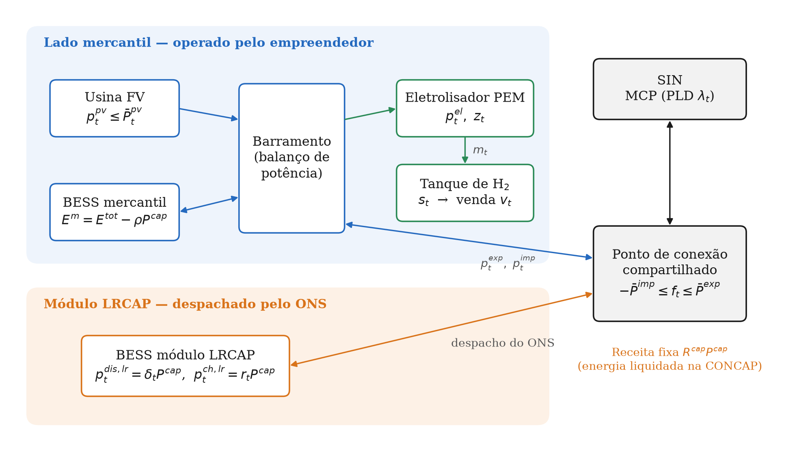
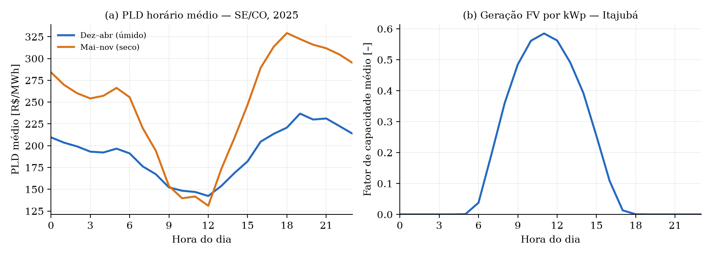
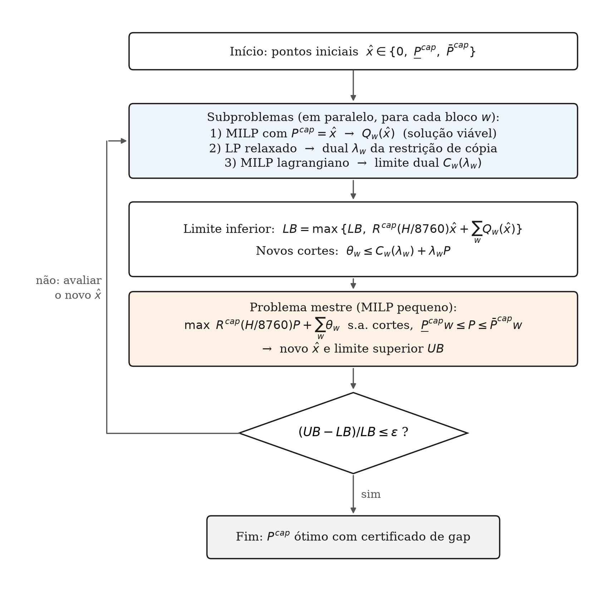

# 3 METODOLOGIA

Este capítulo descreve o modelo de otimização desenvolvido para apoiar a decisão de um empreendedor que opera um sistema híbrido composto por usina fotovoltaica (FV), sistema de armazenamento de energia em baterias (*Battery Energy Storage System*, BESS) e eletrolisador para produção de hidrogênio verde, diante da possibilidade de comercializar parte da capacidade de armazenamento no Leilão de Reserva de Capacidade na forma de Potência (LRCAP) e o restante no Mercado de Curto Prazo (MCP). A Seção 3.1 apresenta o problema e o escopo do estudo; a Seção 3.2 discute o enquadramento regulatório que orienta a modelagem; a Seção 3.3 descreve o sistema; a Seção 3.4 apresenta a formulação matemática; a Seção 3.5 trata dos dados de entrada; a Seção 3.6 descreve o método de solução; a Seção 3.7 apresenta a extensão estocástica do modelo e os indicadores de valor da informação; a Seção 3.8 descreve a construção da curva de oferta no leilão e as análises de sensibilidade; a Seção 3.9 resume a implementação computacional; e a Seção 3.10 consolida as hipóteses e limitações.

## 3.1 Definição do problema e escopo

O problema consiste em determinar, sob a ótica de um agente privado tomador de preço (*price-taker*), a potência a ser contratada no LRCAP e a operação horária ótima do sistema híbrido ao longo de um horizonte anual, de modo a maximizar o lucro operacional do empreendimento. As duas decisões são interdependentes: a potência comprometida com o leilão reduz a capacidade de armazenamento disponível para a operação mercantil, que por sua vez determina quanto da energia fotovoltaica pode ser deslocada no tempo para abastecer o eletrolisador ou para ser comercializada nas horas de maior preço.

O estudo adota as seguintes delimitações de escopo:

a) as capacidades instaladas da usina FV, do BESS e do eletrolisador são dados de entrada, e não variáveis de decisão — o dimensionamento ótimo dos equipamentos está fora do escopo desta etapa, e o efeito do tamanho do eletrolisador e do tanque de hidrogênio é avaliado por análise de sensibilidade (Seção 3.8.3);

b) o horizonte de análise é de um ano, com resolução horária, representativo da operação ao longo do contrato de 15 anos previsto para o LRCAP;

c) na formulação básica, a abordagem é determinística, com conhecimento perfeito das séries de preço, de geração e de despacho do Operador Nacional do Sistema Elétrico (ONS); a incerteza entre anos é tratada pela extensão estocástica da Seção 3.7;

d) a função objetivo considera receitas e custos operacionais; os custos de investimento não entram na otimização, uma vez que as capacidades são fixas, e são considerados a posteriori na análise de viabilidade econômica e do lance mínimo (Seção 3.8.4).

## 3.2 Enquadramento regulatório

As regras aplicáveis ao armazenamento no LRCAP foram estabelecidas pela Portaria Normativa MME nº 136, de 1º de junho de 2026, que define as diretrizes e a sistemática dos leilões de 2026 destinados à contratação de potência a partir de novos sistemas de armazenamento em baterias (BRASIL, 2026). Três aspectos dessa norma condicionam diretamente a formulação.

O primeiro diz respeito à remuneração. A receita fixa contratada deve ser suficiente para "remunerar integralmente todo e qualquer uso que o ONS fizer dos empreendimentos vencedores [...] sem geração de receitas adicionais fora do CRCAP" (BRASIL, 2026, art. 9º, § 5º, IV). Além disso, a energia utilizada na recarga e a energia injetada pelo sistema de armazenamento são liquidadas no MCP ao Preço de Liquidação das Diferenças (PLD), mas os resultados dessa liquidação são destinados à Conta de Potência para Reserva de Capacidade (CONCAP), e não ao empreendedor (art. 9º, § 6º). Consequentemente, a parcela contratada no leilão não pode realizar arbitragem de preços em benefício do seu titular.

O segundo aspecto refere-se ao controle operativo. O empreendimento contratado deve atender à totalidade dos despachos de recarga e de descarga estabelecidos pelo ONS na programação diária e na operação em tempo real (art. 4º, § 2º), e a totalidade da potência contratada deve ser disponibilizada para esse despacho (art. 4º, § 8º). O risco associado à incerteza do despacho é alocado ao empreendedor (art. 5º, § 2º).

O terceiro aspecto é a possibilidade de compartilhamento da conexão. A norma admite que os sistemas de armazenamento sejam instalados no mesmo ponto de conexão de outros agentes, compartilhando as instalações de interesse restrito (art. 4º, § 1º, II).

Diante disso, a "arbitragem" entre o LRCAP e o MCP é modelada neste trabalho como uma **decisão de alocação da capacidade de armazenamento instalada** entre dois módulos com medição individualizada: um **módulo LRCAP**, cuja potência é contratada no leilão, operado exclusivamente segundo o despacho do ONS e remunerado apenas pela receita fixa; e um **módulo mercantil**, que recebe a capacidade remanescente e é operado pelo empreendedor em conjunto com a usina FV e o eletrolisador. Ambos compartilham o ponto de conexão com o Sistema Interligado Nacional (SIN).

A Portaria estabelece, ainda, requisitos técnicos que são incorporados ao modelo como restrições ou como condições de validação dos parâmetros, sintetizados no Quadro 3.1.

::: {custom-style="Legenda"}
Quadro 3.1 – Requisitos da Portaria Normativa MME nº 136/2026 incorporados ao modelo
:::

| Requisito | Dispositivo | Tratamento no modelo |
|------------------------------|------------------|--------------------------------------------------|
| Disponibilidade mínima de 30 MW | art. 7º, III | Restrição disjuntiva na potência contratada (Eq. {eq:cap}) |
| Compromisso de 4 h por ciclo completo | art. 4º, § 3º; art. 7º, IV | Dimensionamento energético do módulo LRCAP (Eq. {eq:hab}) |
| Até 2 ciclos completos diários e 366 anuais | art. 4º, § 3º | Validação do perfil de despacho do ONS |
| Eficiência total (RTE) mínima de 85% | art. 7º, VI | Validação dos parâmetros de eficiência |
| Recarga completa em até 6 h | art. 4º, § 10; art. 7º, VII | Validação dos parâmetros de eficiência |
| Recarga excedente custeada pelo empreendedor | art. 9º, §§ 7º e 8º | Termo de custo na função objetivo (Eq. {eq:kappa}) |
| Uso do sistema para descarga e recarga totais | art. 9º, § 13 | Limite no fluxo líquido do ponto de conexão |

::: {custom-style="Fonte"}
Fonte: elaborado pelo autor com base em Brasil (2026).
:::

## 3.3 Descrição do sistema

A Figura 3.1 apresenta a topologia do sistema modelado. No lado mercantil, a usina FV, o módulo mercantil do BESS e o eletrolisador estão conectados a um barramento comum, no qual se impõe o balanço de potência. O hidrogênio produzido é armazenado em um tanque e comercializado a preço fixo, seja sem limite de volume, seja por meio de um contrato de fornecimento com entrega diária (Seção 3.4.5). A energia excedente pode ser exportada ao SIN e liquidada ao PLD. O módulo LRCAP, embora fisicamente instalado no mesmo sítio, possui ponto de medição próprio e segue um perfil de descarga e recarga determinado pelo ONS. Os fluxos de ambos os lados convergem para o ponto de conexão compartilhado, cuja capacidade limita o fluxo líquido em cada hora.

::: {custom-style="Legenda"}
Figura 3.1 – Topologia do sistema híbrido FV–BESS–H₂ com divisão do BESS entre os módulos LRCAP e mercantil
:::

::: {custom-style="Figura"}
{width=16cm}
:::

::: {custom-style="Fonte"}
Fonte: elaborado pelo autor.
:::

Adota-se como caso de referência uma versão escalonada da planta de produção de hidrogênio da Universidade Federal de Itajubá (UNIFEI), que conta com usina FV de aproximadamente 1 MWp e eletrolisador do tipo membrana de troca de prótons (*Proton Exchange Membrane*, PEM) de 350 kW, sem armazenamento em baterias. Como o LRCAP exige disponibilidade mínima de 30 MW, a planta real não pode participar do leilão; por isso, preserva-se a relação entre as potências do eletrolisador e da usina FV observada na planta (0,35) e escala-se o sistema para 50 MWp de geração FV e 17,5 MW de eletrolisador. O BESS é hipotético e dimensionado para atender aos requisitos do leilão. A justificativa para o escalonamento reside na modularidade dos eletrolisadores PEM, cujas pilhas são associadas em paralelo, de forma que o consumo específico de energia por unidade de hidrogênio é pouco sensível à escala.

## 3.4 Formulação matemática

O problema é formulado como um problema de Programação Linear Inteira Mista (PLIM, ou *Mixed-Integer Linear Programming*, MILP), em que a função objetivo e as restrições são lineares e parte das variáveis é binária.

### 3.4.1 Conjuntos e índices

Seja $\mathcal{T} = \{0, 1, \dots, N-1\}$ o conjunto de intervalos de tempo de duração $\Delta t$ (em horas) e $\mathcal{D}$ o conjunto de dias do horizonte, sendo $\mathcal{T}_d \subseteq \mathcal{T}$ os intervalos pertencentes ao dia $d$.

### 3.4.2 Parâmetros

Os parâmetros do modelo são apresentados na Tabela 3.1, juntamente com os valores adotados no caso de referência.

::: {custom-style="Legenda"}
Tabela 3.1 – Parâmetros do modelo e valores do caso de referência
:::

| Símbolo | Descrição | Unidade | Valor |
|--------------|------------------------------------------------|----------------|------------------|
| $\bar P^{pv}_t$ | Potência FV disponível no intervalo $t$ | MW | série (Seção 3.5) |
| $\lambda_t$ | PLD horário | R\$/MWh | série (Seção 3.5) |
| $E^{tot}$ | Capacidade energética total instalada do BESS | MWh | 300 |
| $\bar P^{ch}, \bar P^{dis}$ | Potências máximas de carga e de descarga do BESS | MW | 60 |
| $\eta^{ch}, \eta^{dis}$ | Eficiências de carga e de descarga | – | 0,95 |
| $\underline\sigma, \bar\sigma$ | Estados de carga mínimo e máximo (fração da energia do módulo) | – | 0,10; 1,00 |
| $\sigma_0$ | Estado de carga inicial do módulo mercantil | – | 0,50 |
| $c^{deg}$ | Custo de degradação por energia descarregada | R\$/MWh | 50 (sensibilidade: 100; 200) |
| $\bar P^{el}$ | Potência nominal do eletrolisador | MW | 17,5 |
| $\alpha^{el}$ | Carga mínima do eletrolisador (fração de $\bar P^{el}$) | – | 0,10 |
| $k^{el}$ | Consumo específico de energia | kWh/kg | 55 |
| $c^{h2}$ | Custo variável de produção de H₂ | R\$/kg | 1,5 |
| $\pi^{h2}$ | Preço de venda do H₂ | R\$/kg | 35 |
| $\bar S, S_0$ | Capacidade e estoque inicial do tanque de H₂ | kg | 2.000; 0 |
| $D^{h2}$ | Entrega mínima diária de H₂ (contrato) | kg/dia | 0 (sem contrato); 2.000 ou 3.000 |
| $\bar D^{h2}$ | Entrega máxima diária de H₂ (demanda do comprador) | kg/dia | ilimitada (sem contrato); igual a $D^{h2}$ |
| $\pi^{def}$ | Multa por kg de H₂ não entregue | R\$/kg | 35 |
| $\bar P^{exp}, \bar P^{imp}$ | Limites de exportação e importação no ponto de conexão | MW | 80 |
| $c^{imp}$ | Custo adicional sobre a energia importada | R\$/MWh | 250 |
| $R^{cap}$ | Receita fixa do LRCAP | R\$/(MW·ano) | 600.000 (sensibilidade: 330.000 a 2.334.000) |
| $\underline P^{cap}$ | Disponibilidade mínima para participação no LRCAP | MW | 30 |
| $H^{cap}$ | Duração do ciclo completo exigida | h | 4 |
| $\rho$ | Energia instalada no módulo LRCAP por MW contratado | MWh/MW | 4,8 |
| $\mathrm{RTE}^{ref}$ | Eficiência de referência para custeio da recarga | – | 0,85 |
| $\delta_t, r_t$ | Despacho do ONS: descarga e recarga do módulo LRCAP (p.u. de $P^{cap}$) | – | perfil (Seção 3.5) |
| $N^{ons}$ | Número de despachos do ONS por ano | – | 365 (sensibilidade: 50; 150) |

::: {custom-style="Fonte"}
Fonte: elaborado pelo autor.
:::

### 3.4.3 Variáveis de decisão

As variáveis de decisão são apresentadas na Tabela 3.2. Destaca-se que $P^{cap}$ é a única variável que não é indexada no tempo: ela representa a decisão de contratação, válida para todo o horizonte, enquanto as demais descrevem a operação horária.

::: {custom-style="Legenda"}
Tabela 3.2 – Variáveis de decisão
:::

| Símbolo | Descrição | Domínio |
|------------------|------------------------------------------------------|--------------------------|
| $P^{cap}$ | Potência contratada no LRCAP | $\mathbb{R}_{\geq 0}$, MW |
| $w$ | Indicador de participação no LRCAP | $\{0, 1\}$ |
| $p^{pv}_t$ | Potência FV aproveitada | $[0, \bar P^{pv}_t]$, MW |
| $p^{ch}_t, p^{dis}_t$ | Potências de carga e descarga do módulo mercantil | $\mathbb{R}_{\geq 0}$, MW |
| $e_t$ | Energia armazenada no módulo mercantil | $\mathbb{R}_{\geq 0}$, MWh |
| $p^{el}_t$ | Potência consumida pelo eletrolisador | $[0, \bar P^{el}]$, MW |
| $m_t, v_t$ | Produção e venda de H₂ | $\mathbb{R}_{\geq 0}$, kg/h |
| $s_t$ | Estoque de H₂ | $[0, \bar S]$, kg |
| $q^{def}_d$ | Déficit de entrega de H₂ no dia $d$ | $\mathbb{R}_{\geq 0}$, kg |
| $p^{exp}_t, p^{imp}_t$ | Exportação e importação do lado mercantil | $\mathbb{R}_{\geq 0}$, MW |
| $y^{bat}_t$ | Estado do módulo mercantil (1 = carregando) | $\{0, 1\}$ |
| $y^{rede}_t$ | Sentido do intercâmbio (1 = exportando) | $\{0, 1\}$ |
| $z_t$ | Estado do eletrolisador (1 = ligado) | $\{0, 1\}$ |

::: {custom-style="Fonte"}
Fonte: elaborado pelo autor.
:::

### 3.4.4 Função objetivo

O objetivo é maximizar o lucro operacional do empreendedor no horizonte, expresso pela Equação {eq:fo}:

$$
\max\; \sum_{t \in \mathcal{T}} \lambda_t\, p^{exp}_t\, \Delta t
- \sum_{t \in \mathcal{T}} \left(\lambda_t + c^{imp}\right) p^{imp}_t\, \Delta t
+ \sum_{t \in \mathcal{T}} \left(\pi^{h2} v_t - c^{h2} m_t\right) \Delta t
- \sum_{d \in \mathcal{D}} \pi^{def} q^{def}_d
+ R^{cap}\, \frac{N \Delta t}{8760}\, P^{cap}
- \kappa\, P^{cap}
- \sum_{t \in \mathcal{T}} c^{deg} \left(p^{dis}_t + \delta_t P^{cap}\right) \Delta t
$$ {#eq:fo}

Os termos correspondem, respectivamente, à receita da energia exportada ao MCP, ao custo da energia importada, à margem da comercialização do hidrogênio, à multa por déficit de entrega de hidrogênio, à receita fixa do LRCAP rateada no horizonte, ao custo da recarga excedente do módulo LRCAP e ao custo de degradação do BESS, aplicado à energia descarregada por ambos os módulos. Ressalta-se que a energia injetada pelo módulo LRCAP não compõe a receita do MCP do empreendedor, em conformidade com o art. 9º, § 6º, da Portaria.

O coeficiente $\kappa$ representa o custo, por MW contratado, da energia de recarga que excede o quociente entre a energia injetada e a eficiência de referência, a qual deve ser custeada pelo empreendedor (BRASIL, 2026, art. 9º, §§ 7º e 8º). Como o perfil de despacho é exógeno e proporcional a $P^{cap}$, $\kappa$ é calculado previamente pela Equação {eq:kappa}:

$$
\kappa = \max\!\left(0,\; 1 - \frac{\sum_{t} \delta_t\, \Delta t}{\mathrm{RTE}^{ref} \sum_{t} r_t\, \Delta t}\right) \sum_{t \in \mathcal{T}} \lambda_t\, r_t\, \Delta t
$$ {#eq:kappa}

Quando a eficiência real do BESS ($\eta^{ch}\eta^{dis}$) supera $\mathrm{RTE}^{ref}$, a recarga determinada pelo ONS não excede o limite custeado pela CONCAP e, portanto, $\kappa = 0$.

### 3.4.5 Restrições

**Contratação no LRCAP.** A potência contratada deve ser nula ou estar entre o mínimo regulatório e o máximo viável, o que é representado pela restrição disjuntiva da Equação {eq:cap}, em que $w$ indica a participação no leilão:

$$
\underline P^{cap}\, w \;\leq\; P^{cap} \;\leq\; \bar P^{cap}\, w
$$ {#eq:cap}

O limite superior $\bar P^{cap}$ é o menor valor entre as potências de carga e descarga do BESS, a razão $E^{tot}/\rho$ e os limites do ponto de conexão.

**Módulo LRCAP.** As potências de descarga e de recarga do módulo LRCAP seguem o perfil de despacho do ONS, expresso em valores por unidade da potência contratada, conforme a Equação {eq:ons}:

$$
p^{dis,lr}_t = \delta_t\, P^{cap}, \qquad p^{ch,lr}_t = r_t\, P^{cap} \qquad \forall t \in \mathcal{T}
$$ {#eq:ons}

Como o perfil é exógeno, o estado de carga do módulo LRCAP é proporcional a $P^{cap}$ e pode ser verificado previamente à otimização. Define-se o estado de carga por MW contratado, $\varepsilon_t$, pela recursão da Equação {eq:epsilon}, com $\varepsilon_{-1} = \bar\sigma\rho$ (módulo inicialmente carregado):

$$
\varepsilon_t = \varepsilon_{t-1} + \left(\eta^{ch} r_t - \frac{\delta_t}{\eta^{dis}}\right) \Delta t, \qquad \underline\sigma\rho \leq \varepsilon_t \leq \bar\sigma\rho
$$ {#eq:epsilon}

Um perfil que viole esses limites é rejeitado na etapa de pré-processamento. O parâmetro $\rho$ deve, ainda, permitir a descarga contínua na potência contratada pela duração exigida, considerando a faixa de operação adotada pelo empreendedor, conforme a Equação {eq:hab}:

$$
\left(\bar\sigma - \underline\sigma\right) \rho\, \eta^{dis} \geq H^{cap}
$$ {#eq:hab}

Com os valores da Tabela 3.1, tem-se $(1{,}0 - 0{,}1) \times 4{,}8 \times 0{,}95 = 4{,}10 \geq 4$ h.

**Módulo mercantil.** O módulo mercantil dispõe da energia e da potência remanescentes após a alocação ao módulo LRCAP. A energia disponível é dada pela Equação {eq:emerc}:

$$
E^{m} = E^{tot} - \rho\, P^{cap}
$$ {#eq:emerc}

A dinâmica do estado de carga e seus limites são descritos pelas Equações {eq:soc} e {eq:soclim}. A condição de contorno impõe que o estado de carga ao final do horizonte não seja inferior ao inicial, evitando que o modelo esvazie o armazenamento para aumentar artificialmente o lucro:

$$
e_t = e_{t-1} + \left(\eta^{ch} p^{ch}_t - \frac{p^{dis}_t}{\eta^{dis}}\right) \Delta t, \qquad e_{-1} = \sigma_0 E^{m}, \qquad e_{N-1} \geq \sigma_0 E^{m}
$$ {#eq:soc}

$$
\underline\sigma\, E^{m} \leq e_t \leq \bar\sigma\, E^{m} \qquad \forall t \in \mathcal{T}
$$ {#eq:soclim}

As potências de carga e de descarga são limitadas pelas Equações {eq:pch} e {eq:pdis}. As restrições com a variável binária $y^{bat}_t$ impedem a carga e a descarga simultâneas, e as restrições com $P^{cap}$ garantem que a potência somada dos dois módulos não exceda a capacidade dos conversores:

$$
p^{ch}_t \leq \bar P^{ch}\, y^{bat}_t, \qquad p^{ch}_t \leq \bar P^{ch} - P^{cap} \qquad \forall t \in \mathcal{T}
$$ {#eq:pch}

$$
p^{dis}_t \leq \bar P^{dis} \left(1 - y^{bat}_t\right), \qquad p^{dis}_t \leq \bar P^{dis} - P^{cap} \qquad \forall t \in \mathcal{T}
$$ {#eq:pdis}

Observa-se que as Equações {eq:soclim}, {eq:pch} e {eq:pdis} são lineares porque $E^{m}$ e os limites remanescentes são funções afins de $P^{cap}$, e não produtos entre variáveis.

**Balanço de potência.** No barramento do lado mercantil, a potência injetada deve igualar a potência consumida em cada intervalo, conforme a Equação {eq:balanco}:

$$
p^{pv}_t + p^{dis}_t + p^{imp}_t = p^{ch}_t + p^{el}_t + p^{exp}_t \qquad \forall t \in \mathcal{T}
$$ {#eq:balanco}

**Intercâmbio com a rede.** A variável binária $y^{rede}_t$ impede a exportação e a importação simultâneas pelo lado mercantil (Equação {eq:rede}). O fluxo líquido no ponto de conexão compartilhado, que inclui os fluxos do módulo LRCAP, é limitado pela Equação {eq:conexao}:

$$
p^{exp}_t \leq \bar P^{exp}\, y^{rede}_t, \qquad p^{imp}_t \leq \bar P^{imp,m} \left(1 - y^{rede}_t\right) \qquad \forall t \in \mathcal{T}
$$ {#eq:rede}

$$
-\bar P^{imp} \;\leq\; p^{exp}_t - p^{imp}_t + p^{dis,lr}_t - p^{ch,lr}_t \;\leq\; \bar P^{exp} \qquad \forall t \in \mathcal{T}
$$ {#eq:conexao}

O parâmetro $\bar P^{imp,m}$ corresponde ao limite de importação do lado mercantil. Para assegurar que todo o hidrogênio produzido seja de origem renovável, adota-se $\bar P^{imp,m} = 0$ no caso de referência: o eletrolisador é suprido exclusivamente pela geração FV, diretamente ou por meio da energia armazenada no módulo mercantil.

**Eletrolisador e hidrogênio.** O eletrolisador opera entre sua carga mínima e sua potência nominal quando ligado, e sua produção é proporcional à potência consumida, com eficiência constante (Equações {eq:el} e {eq:prod}):

$$
\alpha^{el}\, \bar P^{el}\, z_t \;\leq\; p^{el}_t \;\leq\; \bar P^{el}\, z_t \qquad \forall t \in \mathcal{T}
$$ {#eq:el}

$$
m_t = \frac{1000}{k^{el}}\, p^{el}_t \qquad \forall t \in \mathcal{T}
$$ {#eq:prod}

O balanço do tanque de hidrogênio, com condição de contorno análoga à do BESS, é expresso pela Equação {eq:tanque}:

$$
s_t = s_{t-1} + \left(m_t - v_t\right) \Delta t, \qquad s_{-1} = S_0, \qquad s_{N-1} \geq S_0
$$ {#eq:tanque}

**Contrato de fornecimento de hidrogênio.** Sem limite de volume, o hidrogênio funciona como um consumidor de energia de capacidade ilimitada a preço fixo. Com os valores da Tabela 3.1, cada MWh entregue ao eletrolisador vale $(\pi^{h2} - c^{h2}) \cdot 1000/k^{el} \approx$ R\$ 609/MWh, valor muito superior ao PLD médio, de modo que o eletrolisador absorve quase toda a energia disponível e o MCP perde relevância. Na prática, a comercialização de hidrogênio em escala depende de contratos bilaterais com um comprador industrial, cuja demanda é limitada e cuja entrega deve ser regular. Para representar essa situação, o modelo admite um contrato de fornecimento com entrega diária entre $D^{h2}$ e $\bar D^{h2}$, conforme as Equações {eq:entrega} e {eq:entrega-max}:

$$
\sum_{t \in \mathcal{T}_d} v_t\, \Delta t + q^{def}_d \geq D^{h2} \qquad \forall d \in \mathcal{D}
$$ {#eq:entrega}

$$
\sum_{t \in \mathcal{T}_d} v_t\, \Delta t \leq \bar D^{h2} \qquad \forall d \in \mathcal{D}
$$ {#eq:entrega-max}

A variável $q^{def}_d$ representa a parcela da entrega mínima não cumprida no dia $d$, sujeita à multa $\pi^{def}$ na função objetivo. Sem ela, um dia de baixa irradiância tornaria o problema inviável, já que a importação de energia é vedada no caso de referência; com ela, o modelo decide entre produzir o hidrogênio, inclusive com energia previamente armazenada no BESS, e pagar a multa. Quando não há multa definida, adota-se $q^{def}_d = 0$ e a entrega mínima é obrigatória. Nos casos com contrato, adota-se $D^{h2} = \bar D^{h2}$, isto é, um volume diário firme, e $\pi^{def} = \pi^{h2}$, valor que corresponde a ressarcir o comprador pelo produto que ele precisará adquirir de outro fornecedor. Os volumes de 2.000 e 3.000 kg/dia correspondem, respectivamente, a cerca de 65% e 98% da produção média do caso sem contrato (3.060 kg/dia). Nessa configuração, o hidrogênio produzido além do volume contratado não pode ser vendido, e a energia excedente passa a ser exportada ao MCP ou vertida, o que restabelece o papel do mercado de curto prazo na arbitragem. O caso sem contrato corresponde a $D^{h2} = 0$ e $\bar D^{h2}$ ilimitado.

O modelo resultante, composto pela função objetivo da Equação {eq:fo} e pelas restrições das Equações {eq:cap} a {eq:entrega-max}, é um MILP. Sem contrato de hidrogênio, para um horizonte de uma semana (168 h), o problema possui 1.688 variáveis contínuas, 505 variáveis binárias e 2.692 restrições; para um ano (8.760 h), 87.966 variáveis contínuas, 26.281 binárias e 140.164 restrições. O contrato acrescenta duas restrições por dia.

## 3.5 Dados de entrada

**Preço de Liquidação das Diferenças.** Utiliza-se a série horária do PLD de 2025 para o submercado Sudeste/Centro-Oeste, no qual se localiza o município de Itajubá (MG), obtida no portal de dados abertos da Câmara de Comercialização de Energia Elétrica (CCEE, 2026a). A série apresenta média de R\$ 224,31/MWh, com mínimo de R\$ 58,60/MWh — valor do PLD mínimo, observado em 2.030 horas, concentradas no período úmido — e máximo de R\$ 1.421,87/MWh. A Figura 3.2(a) evidencia o perfil diário característico do período recente: preços reduzidos nas horas de maior geração solar e elevados na rampa noturna, com maior amplitude no período seco.

**Geração fotovoltaica.** A disponibilidade de geração FV foi obtida na plataforma *Photovoltaic Geographical Information System* (PVGIS), mantida pelo Centro Comum de Investigação da Comissão Europeia (HULD; MÜLLER; GAMBARDELLA, 2012), a partir da base de reanálise ERA5 (HERSBACH *et al.*, 2020), para as coordenadas de Itajubá (latitude −22,425°; longitude −45,457°; altitude de 848 m). Considerou-se um sistema de silício cristalino de 1 kWp, com perdas de 14% e inclinação e azimute ótimos (25° e −165°, respectivamente), no ano de 2023, o mais recente disponível. A potência horária foi convertida em fator de capacidade, deslocada do tempo universal coordenado para o horário oficial de Brasília (UTC−3) e reposicionada no calendário de 2025, preservando mês, dia e hora, para compatibilização com a série de preços. O fator de capacidade médio resultante é de 16,9%, equivalente a 1.478 kWh/kWp por ano (Figura 3.2(b)). A série é multiplicada pela potência instalada da usina para obter $\bar P^{pv}_t$.

::: {custom-style="Legenda"}
Figura 3.2 – Perfis horários médios dos dados de entrada: (a) PLD do submercado SE/CO em 2025, por período hidrológico; (b) fator de capacidade FV em Itajubá
:::

::: {custom-style="Figura"}
{width=16cm}
:::

::: {custom-style="Fonte"}
Fonte: elaborado pelo autor com dados de CCEE (2026a) e do PVGIS.
:::

**Despacho do ONS.** Na ausência de histórico de despacho de sistemas de armazenamento contratados no LRCAP, adota-se um perfil diário sintético: descarga na potência contratada entre 18 h e 22 h, horário de maior demanda líquida, e recarga entre 10 h e 15 h, até a restauração completa do estado de carga, limitada à potência nominal. O perfil é coerente com a diretriz de que a programação da recarga busque minimizar o custo total de operação do SIN (BRASIL, 2026, art. 4º, § 14), o que tende a deslocá-la para as horas de excedente de geração solar. O perfil resulta em um ciclo completo por dia (365 no ano), dentro dos limites regulatórios. Trata-se da hipótese mais intensa de uso do módulo LRCAP; o efeito de despachos menos frequentes é avaliado na Seção 3.8.2.

**Parâmetros técnico-econômicos.** Os parâmetros do eletrolisador foram definidos a partir da faixa típica da tecnologia PEM, cujo consumo específico de energia situa-se entre 4,3 e 5,2 kWh/Nm³, ou aproximadamente 48 a 58 kWh/kg, até que os dados do fabricante do equipamento da UNIFEI sejam incorporados. O preço do hidrogênio não possui, até o momento, referência de mercado consolidada no Brasil e é, por isso, objeto de análise de sensibilidade. O mesmo se aplica aos termos do contrato de fornecimento de hidrogênio — volume diário e multa por déficit —, avaliados em cenários alternativos ao caso sem contrato.

**Custo de degradação do BESS.** O custo de degradação pode ser estimado como o custo de reposição dos módulos de bateria dividido pela energia que eles descarregam ao longo da vida útil. Com o preço médio de *packs* de baterias de íons de lítio para armazenamento estacionário de US\$ 70/kWh em 2025 (BNEF, 2025), convertido pela taxa PTAX de 09/12/2025 (R\$ 5,4025/US\$) e acrescido de 74% de tributos incidentes no Brasil (EPE, 2024), e com vida útil de 4.000 a 6.000 ciclos a 90% de profundidade de descarga, obtém-se entre R\$ 120 e R\$ 185 por MWh descarregado. O valor de R\$ 50/MWh adotado no caso de referência situa-se abaixo dessa faixa; por isso, o efeito de valores de R\$ 100 e R\$ 200/MWh é avaliado na Seção 3.8.3.

**Receita fixa do LRCAP.** Como ainda não houve leilão de armazenamento em baterias no Brasil, a receita fixa foi delimitada por quatro referências. A inferior é o primeiro leilão do mecanismo italiano de contratação de capacidade de armazenamento (MACSE), realizado em setembro de 2025 com contratos de 15 anos e desenho semelhante ao do LRCAP, cujo preço médio de € 12.959/(MWh·ano) (TERNA, 2025) corresponde, para um sistema de 4 h e com a taxa de câmbio PTAX de 30/09/2025 (R\$ 6,2396/€), a cerca de R\$ 323 mil/(MW·ano). No LRCAP de março de 2026, que contratou o mesmo produto — potência disponível ao ONS —, termelétricas existentes a óleo e biodiesel obtiveram preço médio de R\$ 831 mil/(MW·ano) (CCEE, 2026c), e o conjunto de termelétricas a gás natural, biometano e carvão e de ampliações de hidrelétricas, novas e existentes, R\$ 2,334 milhões/(MW·ano) (CCEE, 2026b). Por fim, o custo de investimento de referência de sistemas de baterias, de R\$ 5.000 a R\$ 6.000/kW (BRASIL; EPE, 2025), corresponde, anualizado a 10% ao ano em 15 anos, a R\$ 657 mil a R\$ 789 mil/(MW·ano), sem considerar operação e manutenção, encargos e reposição de módulos. Com base nessas referências, a análise de sensibilidade abrange receitas fixas de R\$ 330 mil a R\$ 2,33 milhões/(MW·ano). O valor de R\$ 600 mil/(MW·ano) adotado no caso de referência situa-se no extremo inferior dessa faixa, abaixo do preço obtido por usinas existentes e do custo anualizado de investimento em baterias, e constitui, portanto, uma hipótese conservadora quanto à atratividade do leilão.

## 3.6 Método de solução

### 3.6.1 Solução por ramificação e limitação

Problemas MILP são usualmente resolvidos por algoritmos de ramificação e limitação (*branch-and-bound*) combinados à geração de planos de corte, nos quais relaxações lineares sucessivas fornecem limites para o valor ótimo e permitem certificar a qualidade da solução por meio do *gap* de otimalidade. Neste trabalho utiliza-se o *solver* de código aberto HiGHS (HUANGFU; HALL, 2018). Para o horizonte de uma semana, o problema é resolvido em menos de um segundo. Para o horizonte anual, entretanto, a solução direta não foi obtida em 15 minutos de processamento, o que motivou a adoção de uma estratégia de decomposição.

### 3.6.2 Decomposição de Benders

A estrutura do problema favorece a decomposição: a potência contratada $P^{cap}$ é a única variável que acopla todo o horizonte, enquanto as variáveis operacionais de um período se relacionam com as dos períodos vizinhos apenas pelos estados de armazenamento. Dividindo-se o ano em blocos semanais $w \in \mathcal{W}$ e impondo-se condições de contorno cíclicas em cada bloco — aproximação cujo efeito é avaliado ao final desta seção —, o problema anual pode ser reescrito conforme a Equação {eq:benders}:

$$
\max_{P^{cap} \in \{0\} \cup [\underline P^{cap},\, \bar P^{cap}]} \; R^{cap}\, \frac{H}{8760}\, P^{cap} + \sum_{w \in \mathcal{W}} Q_w\!\left(P^{cap}\right)
$$ {#eq:benders}

em que $H$ é o número de horas do horizonte e $Q_w(x)$ é o lucro operacional ótimo do bloco $w$ quando $P^{cap} = x$, obtido pela solução do MILP de 168 horas descrito na Seção 3.4, sem o termo de receita fixa. Esse arranjo corresponde à estrutura clássica da decomposição de Benders (BENDERS, 1962; CONEJO *et al.*, 2006), com $P^{cap}$ como variável do problema mestre e os blocos semanais como subproblemas independentes, que podem ser resolvidos em paralelo.

A decomposição de Benders clássica pressupõe subproblemas lineares contínuos, cuja função valor é côncava (em problemas de maximização) e aproximável por hiperplanos obtidos a partir das variáveis duais. No presente caso, os subproblemas contêm variáveis binárias ($y^{bat}_t$, $y^{rede}_t$ e $z_t$), de modo que $Q_w$ não é, em geral, côncava, e os cortes derivados do dual da relaxação linear não são necessariamente válidos. Para contornar essa limitação, empregam-se os **cortes de Benders reforçados** (*strengthened Benders cuts*) propostos por Zou, Ahmed e Sun (2019). Introduz-se em cada subproblema uma variável de cópia $z_w$, vinculada à decisão do mestre pela restrição $z_w = \hat x$. Sendo $\lambda_w$ o multiplicador dual dessa restrição na relaxação linear do subproblema, calcula-se o valor da relaxação lagrangiana da Equação {eq:lagr}:

$$
C_w\!\left(\lambda_w\right) = \max_{(y,\, z_w) \in X_w} \; f_w(y, z_w) - \lambda_w\, z_w
$$ {#eq:lagr}

em que $X_w$ é o conjunto viável do MILP do bloco, com $z_w$ livre, e $f_w$ é a sua função objetivo operacional. Por dualidade lagrangiana, para qualquer $x$ vale $Q_w(x) \leq C_w(\lambda_w) + \lambda_w x$, o que fornece o corte válido da Equação {eq:corte}:

$$
\theta_w \leq C_w\!\left(\lambda_w\right) + \lambda_w\, P^{cap}
$$ {#eq:corte}

Para preservar a validade do corte mesmo quando o MILP lagrangiano não é resolvido até a otimalidade exata, $C_w$ é tomado como o limite dual reportado pelo *solver*, e não como o valor da melhor solução encontrada.

O problema mestre, apresentado na Equação {eq:mestre}, é um MILP de pequeno porte, com uma variável contínua para a potência, uma binária para a participação e uma variável $\theta_w$ por bloco:

$$
\max\; R^{cap}\, \frac{H}{8760}\, P + \sum_{w \in \mathcal{W}} \theta_w \quad \text{s.a.} \quad \theta_w \leq C^{k}_w + \lambda^{k}_w\, P \;\; \forall w, k; \qquad \underline P^{cap} w \leq P \leq \bar P^{cap} w
$$ {#eq:mestre}

em que $k$ indexa os cortes acumulados ao longo das iterações.

As condições de contorno cíclicas restringem o problema anual, pois impedem transferências de energia e de hidrogênio entre blocos; o valor obtido com blocos semanais é, portanto, um limite inferior do valor do problema anual. Como a solução direta do problema anual não foi obtida, o efeito dessa restrição é estimado comparando-se o lucro anual, para uma mesma potência contratada, com blocos de 7, 14 e 28 dias, e refazendo-se a decomposição com blocos de 14 dias. Se o lucro não aumentar com o tamanho do bloco, a restrição pode ser considerada inativa.

### 3.6.3 Algoritmo e critério de convergência

O procedimento, ilustrado na Figura 3.3, é composto pelas seguintes etapas:

a) **inicialização:** avaliam-se os pontos $\hat x \in \{0,\; \underline P^{cap},\; \bar P^{cap}\}$;

b) **subproblemas:** para cada bloco $w$ e para o ponto $\hat x$, resolvem-se (i) o MILP com $P^{cap} = \hat x$, que fornece $Q_w(\hat x)$; (ii) a relaxação linear, que fornece $\lambda_w$; e (iii) o MILP lagrangiano, que fornece $C_w(\lambda_w)$;

c) **limite inferior:** como o valor $R^{cap} (H/8760)\hat x + \sum_w Q_w(\hat x)$ corresponde a uma solução viável do problema original, ele constitui um limite inferior ($LB$), atualizado com o melhor valor obtido;

d) **problema mestre:** adicionam-se os novos cortes e resolve-se o mestre, cuja solução fornece o próximo ponto $\hat x$ e cujo valor ótimo constitui um limite superior ($UB$), uma vez que os cortes superestimam a função valor;

e) **critério de parada:** o algoritmo termina quando o *gap* relativo $(UB - LB)/LB$ é inferior a uma tolerância $\varepsilon$, adotada como 0,1%. Caso o mestre proponha um ponto já avaliado, o procedimento é interrompido e o *gap* remanescente é reportado como certificado da qualidade da solução.

::: {custom-style="Legenda"}
Figura 3.3 – Fluxograma do algoritmo de decomposição de Benders com cortes reforçados
:::

::: {custom-style="Figura"}
{width=16cm}
:::

::: {custom-style="Fonte"}
Fonte: elaborado pelo autor.
:::

Uma propriedade relevante do método é que ele fornece, a cada iteração, limites superior e inferior para o lucro ótimo, de modo que a qualidade da solução final é certificada, e não apenas estimada. Essa característica o distingue de métodos heurísticos e meta-heurísticos, como algoritmos genéticos, frequentemente empregados em problemas de dimensionamento e operação de sistemas de armazenamento (FENG *et al.*, 2022), mas que não oferecem garantia de otimalidade.

## 3.7 Extensão estocástica e valor da informação

A formulação das Seções 3.4 a 3.6 supõe que as séries de preço e de geração do ano de análise sejam conhecidas no momento da contratação. Na prática, a potência ofertada no LRCAP é definida antes do início do contrato e permanece fixa durante 15 anos, enquanto o PLD e a irradiância variam de um ano para outro. Esta seção apresenta a extensão estocástica do modelo, que trata essa incerteza, e os indicadores utilizados para quantificar o benefício de considerá-la: o valor da solução estocástica (VSS) e o valor esperado da informação perfeita (EVPI).

### 3.7.1 Formulação em dois estágios

O problema é reescrito como um programa estocástico de dois estágios com recurso (BIRGE; LOUVEAUX, 2011; CONEJO; CARRIÓN; MORALES, 2010). No primeiro estágio, decide-se a potência contratada $P^{cap}$, comum a todos os cenários. No segundo estágio, observado o cenário $s \in \mathcal{S}$, com probabilidade $\pi_s$, a operação horária se ajusta de forma ótima à decisão de contratação. O lucro anual do cenário $s$ é dado pela Equação {eq:lucro-cenario}:

$$
\Pi_s\!\left(P^{cap}\right) = R^{cap}\, P^{cap} + \sum_{w \in \mathcal{W}_s} Q_{s,w}\!\left(P^{cap}\right)
$$ {#eq:lucro-cenario}

em que $\mathcal{W}_s$ é o conjunto de blocos semanais do ano associado ao cenário $s$ e $Q_{s,w}$ é o lucro operacional ótimo do bloco, definido como na Seção 3.6.2, com as séries daquele cenário.

Para representar a aversão ao risco do empreendedor, o objetivo combina o lucro esperado com o valor condicional em risco (*Conditional Value-at-Risk*, CVaR), conforme a Equação {eq:estoc}:

$$
\max_{P^{cap} \in \mathcal{X}} \; \sum_{s \in \mathcal{S}} \pi_s\, \Pi_s\!\left(P^{cap}\right) + \beta\, \mathrm{CVaR}_\alpha\!\left(\Pi\!\left(P^{cap}\right)\right)
$$ {#eq:estoc}

em que $\mathcal{X} = \{0\} \cup [\underline P^{cap}, \bar P^{cap}]$ é o conjunto de potências admissíveis, $\beta \geq 0$ é o peso atribuído ao risco ($\beta = 0$ corresponde a um agente neutro ao risco) e $\alpha$ é o nível de confiança do CVaR. Para uma distribuição discreta de lucros, o CVaR corresponde ao lucro médio na cauda inferior de probabilidade $1 - \alpha$ e pode ser escrito na forma linear de Rockafellar e Uryasev (2000), apresentada na Equação {eq:cvar}:

$$
\mathrm{CVaR}_\alpha(\Pi) = \max_{\zeta,\, \nu \geq 0} \left\{ \zeta - \frac{1}{1-\alpha} \sum_{s \in \mathcal{S}} \pi_s\, \nu_s \;\; : \;\; \nu_s \geq \zeta - \Pi_s \;\; \forall s \in \mathcal{S} \right\}
$$ {#eq:cvar}

em que $\zeta$ é uma variável auxiliar cujo valor ótimo corresponde ao valor em risco (VaR) e $\nu_s$ mede o quanto o lucro do cenário $s$ fica abaixo de $\zeta$.

### 3.7.2 Cenários

Os cenários correspondem aos cinco anos históricos de 2021 a 2025, considerados equiprováveis ($\pi_s = 1/5$). Cada cenário reúne:

a) a série horária do PLD do submercado SE/CO do respectivo ano (CCEE, 2026a), corrigida para valores de dezembro de 2025 pelo IPCA (IBGE, 2026), por meio do fator $f_s = \prod_{a = a_s + 1}^{2025} (1 + \mathrm{IPCA}_a)$, em que $a_s$ é o ano do cenário. Com variações anuais do IPCA de 5,79% (2022), 4,62% (2023), 4,83% (2024) e 4,26% (2025), obtêm-se fatores de 1,2097, 1,1435, 1,0930, 1,0426 e 1,0000 para os cenários de 2021 a 2025, respectivamente;

b) a série de fator de capacidade FV obtida no PVGIS a partir da base de satélite SARAH-3, para as mesmas coordenadas e configuração descritas na Seção 3.5. Como a base cobre apenas o período até 2023, os cenários de 2024 e 2025 utilizam a série de 2023;

c) o perfil de despacho do ONS, que, em lugar do perfil fixo da Seção 3.5, passa a depender do preço do cenário: em cada dia, a descarga ocorre no bloco de $H^{cap} = 4$ horas consecutivas de maior PLD médio após o período de geração solar, e a recarga, nas horas de menor PLD da janela entre 8 h e 16 h, até a restauração do estado de carga. Trata-se de uma aproximação do despacho por mínimo custo previsto na Portaria (BRASIL, 2026, art. 4º, § 14), que preserva a correlação entre o despacho e o preço em cada cenário.

No caso estocástico, considera-se ainda um custo por partida do eletrolisador, $c^{part}$, associado a uma variável $u_t \geq z_t - z_{t-1}$, que penaliza ligamentos frequentes.

Com cinco cenários equiprováveis e $\alpha = 0{,}8$, a cauda de probabilidade $1 - \alpha = 0{,}2$ contém exatamente um cenário, de modo que o CVaR coincide com o lucro do pior ano. Ressalta-se que cinco anos constituem uma amostra pequena da variabilidade hidrológica e de preços, de forma que os resultados refletem a amostra histórica disponível e não uma distribuição de probabilidade ajustada.

### 3.7.3 Método de solução

A decomposição de Benders da Seção 3.6 estende-se naturalmente ao caso estocástico: cada par (cenário, bloco semanal) constitui um subproblema independente, e o problema mestre passa a conter uma variável $\theta_{s,w}$ por subproblema, além das variáveis do CVaR, conforme as Equações {eq:mestre-estoc} a {eq:mestre-estoc-cvar}:

$$
\max\; \sum_{s \in \mathcal{S}} \pi_s\, \Pi_s + \beta \left( \zeta - \frac{1}{1-\alpha} \sum_{s \in \mathcal{S}} \pi_s\, \nu_s \right)
$$ {#eq:mestre-estoc}

sujeito a:

$$
\Pi_s = R^{cap} P + \sum_{w \in \mathcal{W}_s} \theta_{s,w} \quad \forall s; \qquad \theta_{s,w} \leq C^{k}_{s,w} + \lambda^{k}_{s,w}\, P \quad \forall s, w, k
$$ {#eq:mestre-estoc-cortes}

$$
\nu_s \geq \zeta - \Pi_s, \quad \nu_s \geq 0 \quad \forall s; \qquad \underline P^{cap} w \leq P \leq \bar P^{cap} w
$$ {#eq:mestre-estoc-cvar}

Como o objetivo é não decrescente em cada $\Pi_s$ e os cortes superestimam $Q_{s,w}$, o valor ótimo do mestre continua a ser um limite superior válido. Os cortes não dependem de $\alpha$ e de $\beta$, o que permite reaproveitá-los na construção da fronteira entre risco e retorno.

Quanto à validade dos cortes reforçados com uma variável de primeiro estágio contínua, observa-se que a desigualdade $Q_{s,w}(x) \leq C_{s,w}(\lambda_{s,w}) + \lambda_{s,w}\, x$ decorre apenas da dualidade lagrangiana e vale para qualquer $x$ admissível, seja ele contínuo ou inteiro. O que exige variáveis de primeiro estágio binárias, no trabalho de Zou, Ahmed e Sun (2019), é a garantia de que os cortes sejam exatos nos pontos avaliados e, portanto, a convergência finita do algoritmo. Como essa garantia não se aplica a $P^{cap}$, a qualidade da solução é atestada pelo *gap* entre os limites superior e inferior, e não pela convergência teórica.

### 3.7.4 Valor da solução estocástica e valor esperado da informação perfeita

O VSS e o EVPI (BIRGE, 1982; BIRGE; LOUVEAUX, 2011) quantificam, respectivamente, o ganho de resolver o problema estocástico em lugar de um problema determinístico baseado em valores médios e o ganho que se obteria caso o cenário fosse conhecido antes da contratação. Ambos são definidos para o objetivo de valor esperado e, por isso, são calculados com $\beta = 0$. Para um problema de maximização, definem-se quatro quantidades.

O valor do **problema estocástico** (*recourse problem*, RP) é o lucro esperado ótimo da Equação {eq:estoc} com $\beta = 0$, dado pela Equação {eq:rp}:

$$
\mathrm{RP} = \max_{P^{cap} \in \mathcal{X}} \; \sum_{s \in \mathcal{S}} \pi_s\, \Pi_s\!\left(P^{cap}\right)
$$ {#eq:rp}

A **solução espera-e-vê** (*wait-and-see*, WS) corresponde a um agente que conhece o cenário antes de decidir a potência e escolhe, em cada um, a contratação ótima, conforme a Equação {eq:ws}:

$$
\mathrm{WS} = \sum_{s \in \mathcal{S}} \pi_s \max_{P^{cap} \in \mathcal{X}} \Pi_s\!\left(P^{cap}\right)
$$ {#eq:ws}

O **problema do valor esperado** (*expected value*, EV) substitui os cenários por um único cenário médio, $\bar\xi$, e fornece a decisão $\bar x^{EV}$, segundo a Equação {eq:ev}:

$$
\bar x^{EV} \in \arg\max_{P^{cap} \in \mathcal{X}} \; \Pi_{\bar\xi}\!\left(P^{cap}\right)
$$ {#eq:ev}

O **valor esperado da solução EV** (EEV) é o lucro esperado obtido quando a decisão $\bar x^{EV}$ é aplicada aos cenários originais, dado pela Equação {eq:eev}:

$$
\mathrm{EEV} = \sum_{s \in \mathcal{S}} \pi_s\, \Pi_s\!\left(\bar x^{EV}\right)
$$ {#eq:eev}

A partir dessas quantidades, os indicadores são dados pelas Equações {eq:evpi} e {eq:vss}:

$$
\mathrm{EVPI} = \mathrm{WS} - \mathrm{RP}
$$ {#eq:evpi}

$$
\mathrm{VSS} = \mathrm{RP} - \mathrm{EEV}
$$ {#eq:vss}

Como $\bar x^{EV}$ é uma decisão admissível para o problema estocástico, e como o agente com informação perfeita pode, em particular, repetir a decisão estocástica em todos os cenários, vale a relação $\mathrm{EEV} \leq \mathrm{RP} \leq \mathrm{WS}$, de modo que ambos os indicadores são não negativos. Um VSS reduzido indica que o modelo determinístico baseado no cenário médio já conduz a uma boa decisão de contratação; um EVPI reduzido indica que a incerteza modelada tem pouco impacto sobre o lucro alcançável, e que, portanto, haveria pouco a ganhar com previsões mais precisas.

O cenário médio $\bar\xi$ é construído pela média hora a hora das séries dos cinco anos, alinhadas por mês, dia e hora, com a exclusão do dia 29 de fevereiro de 2024: $\bar\lambda_t = \sum_{s \in \mathcal{S}} \pi_s\, f_s\, \lambda_{s,t}$ para o PLD corrigido e, analogamente, para o fator de capacidade FV. O perfil de despacho do ONS do cenário médio é obtido pela mesma regra da Seção 3.7.2, aplicada a $\bar\lambda_t$. Destaca-se que o valor ótimo do problema EV não é utilizado como estimativa do lucro: a média hora a hora suaviza os picos e vales de preço e de irradiância e tende a distorcer o lucro operacional. O problema EV serve apenas para gerar a decisão $\bar x^{EV}$, cujo desempenho é avaliado pelo EEV.

O cálculo segue as etapas abaixo:

a) **RP:** resolve-se o problema estocástico com $\beta = 0$ pelo método da Seção 3.7.3;

b) **WS:** resolve-se, para cada cenário $s$ isoladamente, o problema determinístico anual pelo mesmo método, e calcula-se a média ponderada dos valores ótimos;

c) **EV e EEV:** resolve-se o problema anual com o cenário médio para obter $\bar x^{EV}$; em seguida, fixa-se $P^{cap} = \bar x^{EV}$ e resolvem-se os subproblemas de todos os pares (cenário, bloco), o que fornece $\Pi_s(\bar x^{EV})$ e, pela Equação {eq:eev}, o EEV.

Como RP e WS são obtidos com uma tolerância $\varepsilon$ de convergência, adotada como 0,01% nesta etapa, cada um é conhecido por um intervalo $[LB, UB]$. Os indicadores são, então, reportados com os respectivos limites: $\mathrm{EVPI} \in [\mathrm{WS}^{LB} - \mathrm{RP}^{UB},\; \mathrm{WS}^{UB} - \mathrm{RP}^{LB}]$ e $\mathrm{VSS} \in [\mathrm{RP}^{LB} - \mathrm{EEV},\; \mathrm{RP}^{UB} - \mathrm{EEV}]$. Diferenças inferiores à ordem de $\varepsilon \cdot \mathrm{RP}$ não são distinguíveis do erro de convergência e devem ser interpretadas como nulas.

## 3.8 Curva de oferta e análises de sensibilidade

As Seções 3.4 a 3.7 tratam a receita fixa $R^{cap}$ como parâmetro e determinam a potência ótima correspondente. No leilão, contudo, $R^{cap}$ não é um dado: é o preço ofertado pelo próprio empreendedor, e a informação de que ele necessita é a relação entre esse preço e a potência que vale a pena comprometer. Esta seção apresenta o procedimento utilizado para obter essa relação — a curva de oferta — e os casos de sensibilidade avaliados com ele.

### 3.8.1 Custo de oportunidade e curva de oferta

Seja $Q(P)$ o lucro operacional esperado do empreendimento, sem a receita fixa do LRCAP, quando a potência contratada é $P$, dado pela Equação {eq:q} (na prática, calculado com $R^{cap} = 0$):

$$
Q(P) = \sum_{s \in \mathcal{S}} \pi_s\, \Pi_s(P) - R^{cap} P
$$ {#eq:q}

A diferença $Q(0) - Q(P)$ mede quanto lucro operacional o empreendedor deixa de obter — no MCP e na venda de hidrogênio — por comprometer $P$ MW com o leilão, isto é, o custo de oportunidade da contratação. Seu valor por MW adicional, $c^{op}(P) = -\mathrm{d}Q/\mathrm{d}P$, é o custo de oportunidade marginal. Como a decisão envolve uma única variável e o interesse está na curva inteira, e não apenas no seu máximo, $Q$ é avaliada numa grade $\mathcal{X}_h = \{0\} \cup \{\underline P^{cap}, \underline P^{cap} + h, \dots, \bar P^{cap}\}$, com $h = 2{,}5$ MW, resolvendo-se para cada ponto os subproblemas de todos os pares (cenário, bloco) com $P^{cap}$ fixo. O custo de oportunidade marginal é aproximado pelas diferenças finitas da Equação {eq:custo-op}:

$$
c^{op}_j = -\,\frac{Q(P_{j+1}) - Q(P_j)}{P_{j+1} - P_j}, \qquad P_j,\, P_{j+1} \in \mathcal{X}_h, \;\; P_j \geq \underline P^{cap}
$$ {#eq:custo-op}

Para uma receita fixa $R$, a potência ótima a ofertar é dada pela Equação {eq:oferta}, e o conjunto de pares $(R, P^*(R))$ constitui a curva de oferta do empreendedor:

$$
P^*(R) \in \arg\max_{P \in \mathcal{X}_h} \; R\, P + Q(P)
$$ {#eq:oferta}

Dois valores resumem a curva. A receita mínima de entrada, $R^{ent}$, é a menor receita fixa para a qual participar do leilão é preferível a não participar, conforme a Equação {eq:entrada}; a receita de oferta integral, $R^{int}$, é a menor receita para a qual ofertar a potência máxima supera qualquer alternativa, conforme a Equação {eq:integral}:

$$
R^{ent} = \min_{P \in \mathcal{X}_h,\, P > 0} \; \frac{Q(0) - Q(P)}{P}
$$ {#eq:entrada}

$$
R^{int} = \max_{P \in \mathcal{X}_h,\, P < \bar P^{cap}} \; \frac{Q(P) - Q(\bar P^{cap})}{\bar P^{cap} - P}
$$ {#eq:integral}

A curva de oferta não depende do formato do leilão nem do comportamento dos demais proponentes: ela indica, para cada preço, quanta potência o empreendedor estaria disposto a comprometer. Ressalta-se que o investimento no BESS não entra em $Q(P)$, pois as capacidades instaladas são fixas. Esse custo não altera $P^*(R)$ quando o BESS já existe, mas altera a decisão quando ele ainda será construído, situação tratada na Seção 3.8.4.

### 3.8.2 Frequência do despacho do ONS

A frequência com que o ONS acionará os sistemas de armazenamento contratados no LRCAP é desconhecida, e o perfil das Seções 3.5 e 3.7.2 adota a hipótese mais intensa, com um ciclo completo por dia. Para avaliar essa hipótese, o modelo admite um número $N^{ons}$ de despachos por ano. Na ausência de informação sobre o critério do ONS, adota-se como critério o próprio PLD, indicador de quão apertado está o sistema: em cada ano civil, são despachados apenas os $N^{ons}$ dias com maior PLD médio no período de descarga — o bloco de $H^{cap}$ horas de maior preço após o período solar, no perfil baseado em preço, ou as horas de descarga fixas, no perfil fixo. A seleção é feita sobre o ano inteiro, de modo que a decomposição em blocos semanais não a altera. Dias com PLD igual, situação frequente em anos com o PLD no piso, são selecionados por uma sequência de baixa discrepância sobre o dia do ano, o que os distribui uniformemente ao longo do ano em vez de concentrá-los nos primeiros dias. Nos dias sem despacho, o módulo LRCAP permanece carregado e não há recarga.

Como a receita fixa independe da energia despachada e, com os parâmetros da Tabela 3.1, $\kappa = 0$, o despacho afeta o lucro do empreendedor apenas por meio do custo de degradação do módulo LRCAP e do limite do ponto de conexão compartilhado. Se o efeito sobre a conexão for desprezível, o custo associado ao despacho é linear em $P^{cap}$, conforme a Equação {eq:custo-ons}:

$$
C^{ons}(P^{cap}) \approx c^{deg}\, H^{cap}\, N^{ons}\, P^{cap}
$$ {#eq:custo-ons}

e uma variação de $N^{ons}$ desloca o custo de oportunidade marginal de um valor constante, sem alterar a operação do lado mercantil. As simulações com diferentes valores de $N^{ons}$ permitem verificar essa aproximação.

### 3.8.3 Casos avaliados

A curva de oferta é construída para os cenários anuais da Seção 3.7.2, com o lucro esperado ($\beta = 0$), nos casos do Quadro 3.2. Os casos variam as hipóteses que a análise do caso de referência indicou como determinantes para o custo de oportunidade: a existência de um limite de demanda de hidrogênio (Seção 3.4.5), a vedação à importação de energia da rede, a frequência do despacho do ONS, o custo de degradação do BESS e o dimensionamento do eletrolisador e do tanque de hidrogênio.

::: {custom-style="Legenda"}
Quadro 3.2 – Casos avaliados na construção da curva de oferta
:::

| Caso | Contrato de H₂ | Importação da rede | Outras alterações em relação à referência |
|------------------------|------------------------------|----------------------|------------------------|
| Referência | Sem limite de volume | Vedada | – (365 despachos/ano; $c^{deg}$ de R\$ 50/MWh; eletrolisador de 17,5 MW; tanque de 2 t) |
| Contrato 2 t/dia | $D^{h2} = \bar D^{h2} = 2.000$ kg/dia | Vedada | – |
| Contrato 3 t/dia | $D^{h2} = \bar D^{h2} = 3.000$ kg/dia | Vedada | – |
| Importação | Sem limite de volume | Permitida | – |
| Importação e contrato 3 t/dia | $D^{h2} = \bar D^{h2} = 3.000$ kg/dia | Permitida | – |
| Frequência do despacho | Sem limite de volume | Vedada | 50; 150 ou 365 despachos/ano |
| Degradação | Sem limite de volume | Vedada | $c^{deg}$ de R\$ 100 ou 200/MWh |
| Eletrolisador | Sem limite de volume | Vedada | Eletrolisador de 10 ou 25 MW |
| Tanque | $D^{h2} = \bar D^{h2} = 3.000$ kg/dia | Vedada | Tanque de 10 t |

::: {custom-style="Fonte"}
Fonte: elaborado pelo autor.
:::

Nos casos com importação, o eletrolisador e o BESS mercantil podem ser supridos pela rede ao PLD acrescido de $c^{imp}$. Essa configuração corresponde a um critério de qualificação do hidrogênio baseado na intensidade de emissões, e não na origem física da energia, e é avaliada como alternativa à hipótese de suprimento exclusivamente fotovoltaico. Para cada caso, além da curva de oferta, registram-se a potência ótima e a operação média nos cenários para a receita fixa de referência, de R\$ 600 mil/(MW·ano).

### 3.8.4 Viabilidade econômica e lance mínimo

A viabilidade do empreendimento é avaliada pelo valor presente líquido (VPL) de um fluxo de caixa anual constante, em termos reais, ao longo do prazo do contrato do LRCAP ($n = 15$ anos), sem valor residual, conforme a Equação {eq:vpl}:

$$
\mathrm{VPL} = -I + F(i, n)\,\left(\Pi - C^{om}\right), \qquad F(i, n) = \frac{1 - (1 + i)^{-n}}{i}
$$ {#eq:vpl}

em que $I$ é o investimento total na usina FV, no BESS e no eletrolisador, $\Pi$ é o lucro operacional esperado na potência ótima para a receita fixa considerada (Seção 3.8.1), $C^{om}$ é o custo anual de operação e manutenção fixo e $F(i, n)$ é o fator de valor presente de uma série uniforme à taxa real $i$. A taxa interna de retorno (TIR) é a taxa para a qual o VPL é nulo. Os parâmetros adotados são apresentados no Quadro 3.3.

::: {custom-style="Legenda"}
Quadro 3.3 – Parâmetros da análise de viabilidade econômica
:::

| Parâmetro | Valores (baixo; central; alto) | Referência |
|------------------------|------------------------------|------------------------------------|
| Investimento na usina FV | R\$ 3.000; 4.250; 5.500/kW | BRASIL; EPE (2025) |
| Investimento no BESS | R\$ 5.000; 5.500; 6.000/kW | BRASIL; EPE (2025) |
| Investimento no eletrolisador | US\$ 1.100; 2.000; 2.500/kW | IEA (2025): sistemas chineses de US\$ 500 a 1.100/kW e demais de US\$ 1.900 a 2.500/kW; convertidos pela PTAX de 09/12/2025 (R\$ 5,4025/US\$) |
| O&M fixo anual | 1,5% (FV), 2,5% (BESS) e 3% (eletrolisador) do investimento | Hipótese do autor; o O&M variável do eletrolisador e a degradação do BESS já estão no modelo de operação |
| Taxa de desconto real | 8,0% e 12,1% ao ano | ANEEL (2026): custo de capital regulatório da geração, após e antes de impostos |
| Horizonte | 15 anos, sem valor residual | Prazo do contrato do LRCAP |

::: {custom-style="Fonte"}
Fonte: elaborado pelo autor.
:::

Como o lucro operacional não considera tributos sobre a renda, o VPL calculado com a taxa após impostos é otimista; a taxa antes de impostos fornece uma avaliação mais conservadora. A partir do VPL, calcula-se ainda o preço de equilíbrio do hidrogênio, $\pi^{h2,eq} = \pi^{h2} - \mathrm{VPL} / (F(i, n)\, V)$, em que $V$ é a quantidade anual de hidrogênio vendida. Essa expressão mantém a operação fixa e, portanto, superestima ligeiramente o preço de equilíbrio, pois um preço maior levaria a uma produção maior.

Para isolar a contribuição da bateria, o modelo é resolvido também sem o BESS e, consequentemente, sem participação no leilão, o que fornece o lucro operacional $\Pi^{0}$ da usina FV com o eletrolisador. Quando o BESS ainda será construído, o proponente compara, para cada receita fixa $R$, a alternativa de não construí-lo com a de construí-lo e contratar a melhor potência, deduzido o custo anual equivalente do BESS, $C^{bess} = I^{bess} / F(i, n) + C^{om,bess}$. A potência ofertada passa a ser dada pela Equação {eq:oferta-inv}:

$$
P^{*}_{inv}(R) = \begin{cases} \arg\max_{P \in \mathcal{X}_h} \left\{ R P + Q(P) \right\}, & \text{se } \max_{P \in \mathcal{X}_h} \left\{ R P + Q(P) \right\} - C^{bess} > \Pi^{0} \\ 0, & \text{caso contrário} \end{cases}
$$ {#eq:oferta-inv}

O lance mínimo, $R^{min}$, é a menor receita fixa para a qual a construção do BESS é vantajosa, isto é, o menor $R$ para o qual $P^{*}_{inv}(R) > 0$. Ele é calculado para as três faixas de investimento e para as duas taxas de desconto do Quadro 3.3.

## 3.9 Implementação computacional

O modelo foi implementado na linguagem Python, com o uso da biblioteca de modelagem algébrica Pyomo (BYNUM *et al.*, 2021) e do *solver* HiGHS (HUANGFU; HALL, 2018). A estrutura do código separa: (i) a leitura e validação dos parâmetros, organizados em arquivos de configuração em formato YAML, com verificação automática dos requisitos regulatórios; (ii) a importação e o tratamento das séries de dados; (iii) a construção do modelo de otimização; (iv) a decomposição de Benders, nas versões determinística e estocástica; (v) o cálculo do VSS e do EVPI; (vi) a construção da curva de oferta; (vii) a análise de viabilidade econômica e do lance mínimo; e (viii) o pós-processamento dos resultados. Os subproblemas semanais são resolvidos em paralelo em processos independentes, cada qual restrito a uma linha de execução do *solver*, a fim de evitar a concorrência por núcleos de processamento. A consistência do modelo é verificada por um conjunto de testes automatizados que conferem, entre outros aspectos, o balanço de potência, os limites dos estados de carga, a exclusividade entre carga e descarga, o cumprimento do despacho do ONS e a seleção dos dias de despacho, o limite do ponto de conexão, as entregas do contrato de hidrogênio e a validade dos cortes de Benders. O código e os dados são mantidos sob controle de versão, o que assegura a reprodutibilidade dos resultados.

## 3.10 Hipóteses e limitações

As principais hipóteses adotadas, e as respectivas implicações, são as seguintes:

a) **previsão perfeita dentro de cada ano:** mesmo na extensão estocástica, a operação de cada cenário é otimizada com conhecimento antecipado das séries daquele ano, o que tende a superestimar o lucro alcançável na operação real. A incerteza tratada pela Seção 3.7 é apenas a variação entre anos; a incerteza do despacho do ONS, cujo risco é alocado ao empreendedor pela Portaria, é representada somente pela regra de despacho baseada no PLD e pela sensibilidade ao número de despachos por ano (Seção 3.8.2), que supõe despachos completos, de $H^{cap}$ horas na potência contratada, nos dias de maior PLD;

b) **agente tomador de preço:** a operação do sistema não altera o PLD;

c) **receita fixa simplificada:** a receita fixa é rateada linearmente no horizonte, sem reajuste pelo Índice Nacional de Preços ao Consumidor Amplo (IPCA), sem o abatimento mensal por desempenho e sem as penalidades por indisponibilidade, cujos detalhes dependem do edital do leilão;

d) **disponibilidade integral:** o módulo LRCAP atende a 100% do despacho, sem indisponibilidades programadas ou forçadas;

e) **eletrolisador simplificado:** eficiência constante em toda a faixa de operação, com custo de partida apenas na extensão estocástica e sem tempos mínimos de operação e de parada, estado de espera (*standby*) ou limites de rampa;

f) **degradação linear:** o custo de degradação do BESS é proporcional à energia descarregada, sem dependência da profundidade de descarga, e seu valor de referência (R\$ 50/MWh) é inferior à estimativa baseada no custo de reposição dos módulos, o que é tratado por análise de sensibilidade;

g) **divisão contínua do BESS:** a alocação entre os módulos é tratada como contínua, embora na prática seja discreta, em função da modularidade dos contêineres e conversores;

h) **condições cíclicas semanais:** a decomposição impõe que os estados de armazenamento retornem ao valor inicial ao final de cada semana, impedindo transferências de energia ou de hidrogênio entre semanas; o efeito dessa restrição é verificado com blocos de até 28 dias (Seção 3.6.2);

i) **anos distintos:** no caso determinístico, a série de irradiância (2023) e a de preços (2025) referem-se a anos diferentes; no caso estocástico, o mesmo ocorre nos cenários de 2024 e 2025, que utilizam a irradiância de 2023. Para uma usina de pequeno porte em relação ao SIN, a correlação horária entre a geração local e o PLD tende a ser fraca, mas a hipótese deve ser considerada na interpretação dos resultados;

j) **contrato de hidrogênio simplificado:** o contrato é representado por um volume diário fixo, a preço fixo e com multa linear por déficit. Não se consideram cláusulas de *take-or-pay* sobre volumes anuais, flexibilidade de entrega entre dias, reajuste de preço ou a venda do excedente a outros compradores, e a multa adotada é um valor de referência ainda não calibrado com contratos reais;

k) **curva de oferta discreta:** a curva é obtida numa grade de 2,5 MW, de modo que a potência ótima e os custos marginais são conhecidos com essa resolução, e não inclui o investimento no BESS;

l) **viabilidade simplificada:** a análise de viabilidade considera fluxo de caixa constante em termos reais, sem tributos sobre a renda, sem financiamento, sem valor residual e com custo de O&M fixo hipotético, e utiliza o lucro operacional calculado com os parâmetros provisórios de operação;

m) **amostra de cenários:** os cinco anos históricos são tratados como equiprováveis e constituem uma amostra pequena; o VSS e o EVPI são, portanto, medidos dentro da amostra, e a avaliação da decisão fora da amostra é deixada para trabalhos futuros.

## REFERÊNCIAS

::: {custom-style="Referencia"}
ANEEL – AGÊNCIA NACIONAL DE ENERGIA ELÉTRICA. **Atualização das taxas regulatórias de remuneração do capital (WACC) dos segmentos de geração, transmissão e distribuição**. Brasília: ANEEL, mar. 2026.
:::

::: {custom-style="Referencia"}
BENDERS, J. F. Partitioning procedures for solving mixed-variables programming problems. **Numerische Mathematik**, v. 4, n. 1, p. 238–252, 1962.
:::

::: {custom-style="Referencia"}
BIRGE, J. R. The value of the stochastic solution in stochastic linear programs with fixed recourse. **Mathematical Programming**, v. 24, n. 1, p. 314–325, 1982.
:::

::: {custom-style="Referencia"}
BIRGE, J. R.; LOUVEAUX, F. **Introduction to stochastic programming**. 2. ed. New York: Springer, 2011.
:::

::: {custom-style="Referencia"}
BNEF – BLOOMBERGNEF. **Lithium-ion battery pack prices fall to \$108 per kilowatt-hour, despite rising metal prices**. Londres: BloombergNEF, 9 dez. 2025. Disponível em: https://about.bnef.com. Acesso em: 3 out. 2026.
:::

::: {custom-style="Referencia"}
BRASIL. Ministério de Minas e Energia. Portaria Normativa MME nº 136, de 1º de junho de 2026. Estabelece as Diretrizes e a Sistemática para a realização dos Leilões para Contratação de Potência Elétrica, a partir de novos sistemas de armazenamento de energia em baterias. **Diário Oficial da União**: seção 1, Brasília, DF, n. 103, p. 98, 3 jun. 2026.
:::

::: {custom-style="Referencia"}
BRASIL. Ministério de Minas e Energia; EPE – EMPRESA DE PESQUISA ENERGÉTICA. **Caderno de parâmetros de custos**: geração e transmissão – PDE 2035. Brasília: MME/EPE, nov. 2025.
:::

::: {custom-style="Referencia"}
BYNUM, M. L. *et al.* **Pyomo**: optimization modeling in Python. 3. ed. Cham: Springer, 2021.
:::

::: {custom-style="Referencia"}
CCEE – CÂMARA DE COMERCIALIZAÇÃO DE ENERGIA ELÉTRICA. **PLD horário**. Portal de Dados Abertos da CCEE. 2026a. Disponível em: https://dadosabertos.ccee.org.br. Acesso em: 27 set. 2026.
:::

::: {custom-style="Referencia"}
CCEE – CÂMARA DE COMERCIALIZAÇÃO DE ENERGIA ELÉTRICA. **InfoLeilão Expresso**: 04º LRCAP 2026 – Leilão nº 2/2026-ANEEL. São Paulo: CCEE, mar. 2026b. Disponível em: https://www.ccee.org.br. Acesso em: 3 out. 2026.
:::

::: {custom-style="Referencia"}
CCEE – CÂMARA DE COMERCIALIZAÇÃO DE ENERGIA ELÉTRICA. **InfoLeilão Expresso**: 05º LRCAP 2026 – Leilão nº 3/2026-ANEEL. São Paulo: CCEE, mar. 2026c. Disponível em: https://www.ccee.org.br. Acesso em: 3 out. 2026.
:::

::: {custom-style="Referencia"}
CONEJO, A. J. *et al.* **Decomposition techniques in mathematical programming**: engineering and science applications. Berlin: Springer, 2006.
:::

::: {custom-style="Referencia"}
CONEJO, A. J.; CARRIÓN, M.; MORALES, J. M. **Decision making under uncertainty in electricity markets**. New York: Springer, 2010.
:::

::: {custom-style="Referencia"}
EPE – EMPRESA DE PESQUISA ENERGÉTICA. **Plano Decenal de Expansão de Energia 2034**: caderno de micro e minigeração distribuída e baterias. Rio de Janeiro: EPE, 2024.
:::

::: {custom-style="Referencia"}
FENG, L. *et al.* Optimization analysis of energy storage application based on electricity price arbitrage and ancillary services. **Journal of Energy Storage**, v. 55, p. 105508, 2022.
:::

::: {custom-style="Referencia"}
HERSBACH, H. *et al.* The ERA5 global reanalysis. **Quarterly Journal of the Royal Meteorological Society**, v. 146, n. 730, p. 1999–2049, 2020.
:::

::: {custom-style="Referencia"}
IEA – INTERNATIONAL ENERGY AGENCY. **Global Hydrogen Review 2025**. Paris: IEA, out. 2025.
:::

::: {custom-style="Referencia"}
IBGE – INSTITUTO BRASILEIRO DE GEOGRAFIA E ESTATÍSTICA. **Índice Nacional de Preços ao Consumidor Amplo (IPCA)**: séries históricas. Rio de Janeiro: IBGE, 2026. Disponível em: https://www.ibge.gov.br/estatisticas/economicas/precos-e-custos/9256-indice-nacional-de-precos-ao-consumidor-amplo.html. Acesso em: 3 out. 2026.
:::

::: {custom-style="Referencia"}
HUANGFU, Q.; HALL, J. A. J. Parallelizing the dual revised simplex method. **Mathematical Programming Computation**, v. 10, n. 1, p. 119–142, 2018.
:::

::: {custom-style="Referencia"}
HULD, T.; MÜLLER, R.; GAMBARDELLA, A. A new solar radiation database for estimating PV performance in Europe and Africa. **Solar Energy**, v. 86, n. 6, p. 1803–1815, 2012.
:::

::: {custom-style="Referencia"}
ROCKAFELLAR, R. T.; URYASEV, S. Optimization of conditional value-at-risk. **Journal of Risk**, v. 2, n. 3, p. 21–41, 2000.
:::

::: {custom-style="Referencia"}
TERNA. **Terna completes first MACSE auction**: 10 GWh of energy storage capacity awarded. Roma: Terna S.p.A., 1 out. 2025. Comunicado de imprensa. Disponível em: https://www.terna.it. Acesso em: 3 out. 2026.
:::

::: {custom-style="Referencia"}
ZOU, J.; AHMED, S.; SUN, X. A. Stochastic dual dynamic integer programming. **Mathematical Programming**, v. 175, n. 1–2, p. 461–502, 2019.
:::
