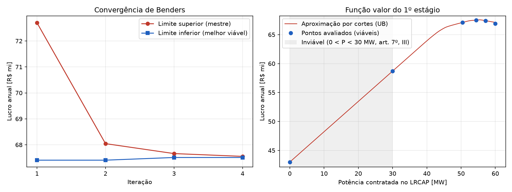
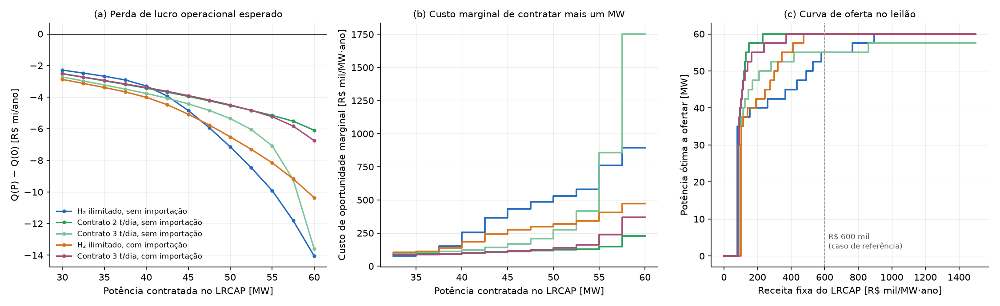
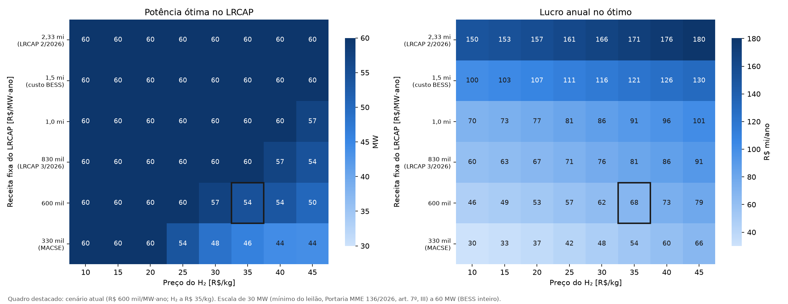
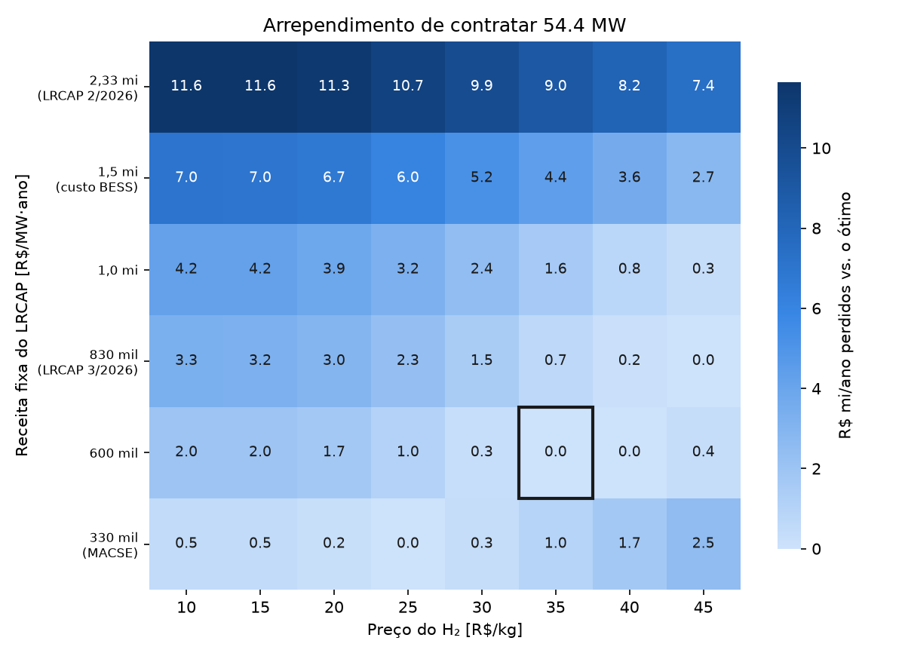
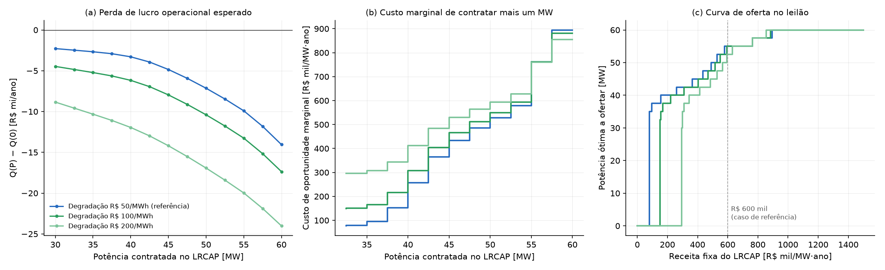
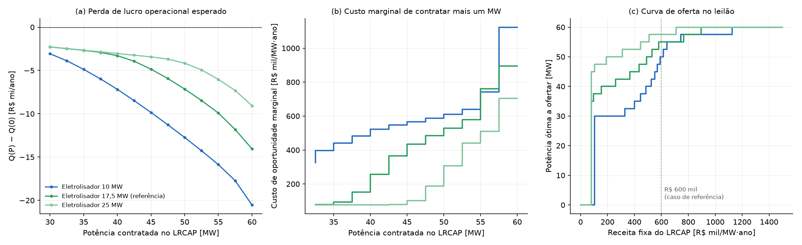
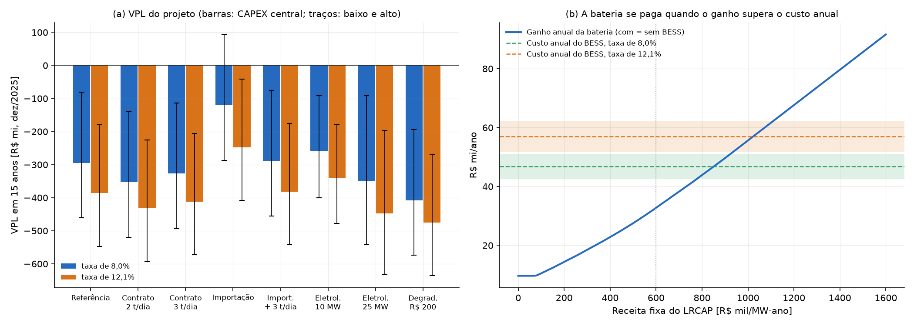
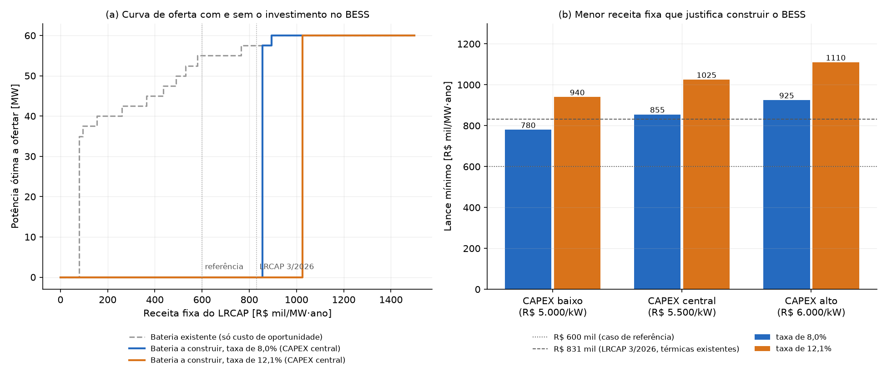

# 4 RESULTADOS E DISCUSSÃO

Este capítulo apresenta os resultados do modelo descrito no Capítulo 3, aplicado ao caso de referência: a planta da UNIFEI escalonada para 50 MWp de geração FV e 17,5 MW de eletrolisador PEM, com BESS hipotético de 60 MW e 300 MWh, conectada ao submercado SE/CO. Salvo indicação em contrário, os resultados das Seções 4.2 a 4.6 e 4.8 correspondem ao lucro esperado nos cinco cenários anuais de 2021 a 2025 (Seção 3.7.2), em valores de dezembro de 2025; as Seções 4.1 e 4.7 e a análise da decomposição na Seção 4.8 utilizam o caso determinístico de 2025 (Seção 3.5). A Seção 4.1 apresenta o caso determinístico de 2025, que serve de referência para o desempenho do método de solução; a Seção 4.2, a decisão de contratação e a operação no modelo estocástico; a Seção 4.3, o valor da solução estocástica e da informação perfeita; a Seção 4.4, a curva de oferta no leilão; a Seção 4.5, o efeito do contrato de hidrogênio e da importação de energia; a Seção 4.6, o efeito da frequência do despacho do ONS; a Seção 4.7, a sensibilidade à receita fixa e ao preço do hidrogênio; a Seção 4.8, a robustez dos resultados ao custo de degradação, ao dimensionamento e à decomposição; a Seção 4.9, a viabilidade econômica e o lance mínimo; e a Seção 4.10 sintetiza os resultados.

Ressalta-se que parte dos parâmetros econômicos — em especial a receita fixa do LRCAP (R\$ 600 mil/(MW·ano)), o preço do hidrogênio (R\$ 35/kg), o custo de degradação do BESS (R\$ 50/MWh) e a multa contratual por déficit de hidrogênio — tem caráter provisório, conforme discutido na Seção 3.5. Por isso, a ênfase deste capítulo recai sobre as relações entre as decisões e as hipóteses, e não sobre os valores absolutos de lucro.

## 4.1 Caso determinístico de 2025 e desempenho do método

O caso determinístico utiliza o PLD do submercado SE/CO de 2025, a geração FV obtida da base ERA5 e o perfil fixo de despacho do ONS descritos na Seção 3.5, com o ano dividido em 52 blocos semanais. A Figura 4.1 apresenta a convergência do algoritmo de Benders e a aproximação da função valor do primeiro estágio construída pelos cortes.

::: {custom-style="Legenda"}
Figura 4.1 – Caso determinístico de 2025: (a) limites superior e inferior ao longo das iterações de Benders; (b) aproximação da função valor pelos cortes e pontos avaliados
:::

::: {custom-style="Figura"}
{width=16cm}
:::

::: {custom-style="Fonte"}
Fonte: elaborado pelo autor.
:::

Após a avaliação dos três pontos iniciais (0, 30 e 60 MW), o limite superior parte de R\$ 72,7 milhões, e o algoritmo converge em quatro iterações, com *gap* final de 0,06%, em 67 segundos de processamento em quatro núcleos — tempo inferior ao de uma única tentativa de solução direta do MILP anual, interrompida após 15 minutos sem solução (Seção 3.6.1). A Figura 4.1(b) mostra que a função valor é crescente e aproximadamente linear até cerca de 45 MW e praticamente plana entre 50 e 60 MW, o que explica a convergência rápida: poucos cortes bastam para delimitar a região do ótimo.

O ótimo encontrado é $P^{cap} = 54{,}4$ MW, com lucro de R\$ 67,5 milhões no ano. A Tabela 4.1 compara a composição desse resultado com o ótimo do modelo estocástico, apresentado na Seção 4.2.

::: {custom-style="Legenda"}
Tabela 4.1 – Comparação entre o caso determinístico de 2025 e o modelo estocástico
:::

| Indicador | Determinístico (2025) | Estocástico (2021–2025, média) |
|------------------------------------|--------------------|--------------------|
| Potência ótima no LRCAP (MW) | 54,4 | 54,4 |
| Lucro (R\$ milhões/ano) | 67,5 | 68,1 |
| Receita fixa do LRCAP (R\$ milhões/ano) | 32,7 | 32,6 |
| Receita de H₂ (R\$ milhões/ano) | 39,1 | 36,0 |
| Receita no MCP (R\$ milhões/ano) | 1,8 | 5,1 |
| Degradação do BESS (R\$ milhões/ano) | 4,4 | 4,4 |
| H₂ produzido (t/ano) | 1.117 | 1.029 |
| Fator de capacidade do eletrolisador | 0,40 | 0,37 |

::: {custom-style="Fonte"}
Fonte: elaborado pelo autor. Valores do modelo estocástico obtidos na grade de 55 MW, exceto potência, lucro e receita fixa.
:::

As duas abordagens conduzem à mesma potência ótima. As diferenças de composição decorrem principalmente do preço. Embora a série ERA5 de 2025 apresente fator de capacidade FV ligeiramente inferior ao da média dos cenários SARAH-3 (16,9% contra 17,5%), o caso determinístico produz mais hidrogênio. No modelo estocástico, os picos de PLD do cenário de 2021, que superam o valor da energia no eletrolisador, tornam a exportação ao MCP mais vantajosa em parte das horas, o que eleva a receita média no mercado de curto prazo e reduz a produção de hidrogênio. A coincidência das potências ótimas antecipa o resultado da Seção 4.3: a variação entre anos pouco altera a decisão de contratação.

## 4.2 Decisão de contratação no modelo estocástico

A Figura 4.2(a) apresenta o lucro anual de cada cenário, o lucro esperado e o CVaR em função da potência contratada no LRCAP. Participar do leilão é vantajoso em todos os cenários: a contratação do mínimo regulatório de 30 MW eleva o lucro esperado de R\$ 45,0 milhões para R\$ 60,7 milhões por ano, um acréscimo de 35%. A partir desse ponto, o lucro esperado continua a crescer, porém a taxas decrescentes, até um máximo e decresce em seguida, quando a potência contratada passa a retirar do módulo mercantil a capacidade que abastece o eletrolisador durante a noite.

::: {custom-style="Legenda"}
Figura 4.2 – Lucro anual em função da potência contratada no LRCAP: (a) por cenário, lucro esperado e CVaR; (b) por cenário, para quatro decisões de contratação
:::

::: {custom-style="Figura"}
{width=16cm}
:::

::: {custom-style="Fonte"}
Fonte: elaborado pelo autor.
:::

O ótimo, assinalado na Figura 4.2, é $P^{cap} = 54{,}4$ MW, com lucro esperado de R\$ 68,12 milhões por ano, obtido com tolerância de convergência de 0,01%. Com a tolerância de 0,1% usada inicialmente, o algoritmo de Benders havia encerrado em 53,4 MW, com lucro esperado apenas R\$ 20 mil inferior. A diferença ilustra uma característica central do problema: a função de lucro é muito plana na vizinhança do ótimo, com variação inferior a 0,4% entre 50 e 56 MW. Do ponto de vista prático, a decisão relevante é contratar entre 50 e 55 MW; a localização exata do máximo é menos importante do que as hipóteses que o determinam, examinadas nas seções seguintes.

O lucro por cenário na potência ótima é apresentado na Tabela 4.2. O pior cenário é 2022, ano em que o PLD permaneceu próximo do piso regulatório, e o melhor, 2021, ano da crise hídrica. A diferença entre eles, de cerca de R\$ 8 milhões por ano, é pequena diante do ganho proporcionado pela participação no leilão.

::: {custom-style="Legenda"}
Tabela 4.2 – Lucro anual por cenário na potência ótima (54,4 MW)
:::

| Cenário | 2021 | 2022 | 2023 | 2024 | 2025 | Esperado | CVaR ($\alpha = 0{,}8$) |
|------------|---------|---------|---------|---------|---------|---------|---------|
| Lucro (R\$ milhões/ano) | 73,47 | 65,38 | 66,58 | 67,40 | 67,77 | 68,12 | 65,38 |

::: {custom-style="Fonte"}
Fonte: elaborado pelo autor.
:::

A fronteira entre risco e retorno, obtida com pesos $\beta \in \{0;\ 0{,}5;\ 1;\ 2\}$ para o CVaR, degenerou em um único ponto: a mesma potência maximiza o lucro esperado e o lucro do pior ano, com *gap* inferior a 0,07% em todos os casos. Não há, portanto, troca entre risco e retorno nesta configuração, pois a dispersão entre os cenários pouco depende da decisão de contratação, como se observa na Figura 4.2(b): as barras de cada decisão se deslocam praticamente em paralelo entre os anos.

A composição do lucro médio na potência de 55 MW, ponto da grade da Seção 3.8 mais próximo do ótimo, é: R\$ 33,0 milhões de receita fixa do LRCAP, R\$ 36,0 milhões de receita com hidrogênio e R\$ 5,1 milhões no MCP, deduzidos R\$ 4,4 milhões de degradação do BESS e R\$ 1,6 milhão de custos variáveis de produção de hidrogênio. O eletrolisador consome 56,6 GWh por ano, cerca de três quartos da energia FV disponível, com fator de capacidade de 0,37, e produz 1.029 t de hidrogênio; os 19,4 GWh restantes são exportados ao MCP. Esse resultado antecipa a principal conclusão da Seção 4.5: com o hidrogênio vendido sem limite de volume a R\$ 35/kg, cada MWh destinado ao eletrolisador vale cerca de R\$ 609, e o MCP tem papel secundário na operação.

## 4.3 Valor da solução estocástica e valor esperado da informação perfeita

A Tabela 4.3 compara a decisão estocástica (RP) com a decisão obtida no ano médio (EV) e com a solução espera-e-vê (WS), calculadas segundo a Seção 3.7.4.

::: {custom-style="Legenda"}
Tabela 4.3 – Decisões e lucro anual por cenário para o cálculo do VSS e do EVPI
:::

| Decisão | $P^{cap}$ (MW) | 2021 | 2022 | 2023 | 2024 | 2025 | Esperado |
|----------------------|------------------|-------|-------|-------|-------|-------|----------|
| RP (estocástica) | 54,38 | 73,47 | 65,38 | 66,58 | 67,40 | 67,77 | 68,121 |
| EV (ano médio) | 54,34 | 73,46 | 65,39 | 66,58 | 67,40 | 67,77 | 68,121 |
| WS (por cenário) | 60,0 / 51,5 / 51,0 / 52,7 / 54,6 | 73,95 | 65,47 | 66,70 | 67,44 | 67,77 | 68,266 |

::: {custom-style="Fonte"}
Fonte: elaborado pelo autor. Lucros em R\$ milhões/ano.
:::

O VSS resultou em cerca de R\$ 300 por ano (menos de 0,001% do RP), valor inferior à tolerância de convergência e, portanto, indistinguível de zero. A decisão obtida no ano médio coincide, para efeitos práticos, com a decisão estocástica. O EVPI foi de R\$ 145 mil por ano (0,21% do RP), com limite superior de R\$ 161 mil. Quase toda a perda decorre do cenário de 2021, no qual a decisão ótima com informação perfeita seria contratar toda a potência do BESS (60 MW); nos demais anos, as decisões ótimas situam-se entre 51 e 55 MW.

Dois aspectos merecem destaque. Primeiro, embora o ano médio conduza à decisão correta, ele superestima o lucro: o valor ótimo do problema EV foi de R\$ 68,89 milhões, contra R\$ 68,12 milhões do EEV. A diferença, de cerca de R\$ 0,8 milhão por ano, resulta da suavização dos picos e vales de preço e de irradiância pela média hora a hora, e confirma que o ano médio não deve ser usado para estimar a receita do empreendimento. Segundo, os baixos valores de VSS e de EVPI indicam que a incerteza modelada — a variação de preço e de geração entre anos — tem pouco efeito sobre a decisão de contratação. As seções seguintes mostram que outras hipóteses, não representadas nos cenários, têm efeito muito maior.

## 4.4 Curva de oferta no leilão

A Figura 4.3 apresenta o resultado do procedimento da Seção 3.8 para os cinco casos de contrato de hidrogênio e de importação do Quadro 3.2. No caso de referência (curvas em azul), o custo de oportunidade marginal cresce de forma acentuada com a potência contratada: até 37,5 MW, cada MW adicional custa menos de R\$ 100 mil/(MW·ano), enquanto os últimos 5 MW custam entre R\$ 760 mil e R\$ 900 mil/(MW·ano) (Figura 4.3(b)). A receita mínima de entrada é de R\$ 76 mil/(MW·ano) e a receita necessária para ofertar toda a potência do BESS é de R\$ 895 mil/(MW·ano).

::: {custom-style="Legenda"}
Figura 4.3 – Curva de oferta no LRCAP para os casos de contrato de hidrogênio e de importação: (a) perda de lucro operacional esperado; (b) custo de oportunidade marginal; (c) potência ótima em função da receita fixa
:::

::: {custom-style="Figura"}
{width=16cm}
:::

::: {custom-style="Fonte"}
Fonte: elaborado pelo autor.
:::

O formato da curva decorre da divisão do BESS entre os módulos. Até cerca de 37,5 MW contratados, o módulo mercantil retém energia e potência suficientes para deslocar a geração FV excedente para o eletrolisador nas horas noturnas, e a contratação adicional retira apenas a capacidade de menor valor. A partir desse ponto, cada MW contratado reduz em 4,8 MWh a energia e em 1 MW a potência do módulo mercantil, que se aproxima de zero quando $P^{cap}$ tende a 60 MW, e o eletrolisador deixa de operar à noite. A Figura 4.3(c) traduz essa relação em uma curva de oferta escalonada: para receitas entre R\$ 80 mil e R\$ 300 mil/(MW·ano), o empreendedor ofertaria entre 35 e 42,5 MW; para R\$ 600 mil, 55 MW; e somente acima de cerca de R\$ 900 mil ofertaria toda a capacidade.

Esse resultado tem duas implicações para o proponente. A decisão de participar do leilão é robusta, pois o limiar de entrada é baixo em todos os casos avaliados (R\$ 76 mil a R\$ 96 mil/(MW·ano)), muito inferior a qualquer receita fixa plausível para sistemas de armazenamento. Por outro lado, a quantidade a ofertar acima de cerca de 40 MW é sensível tanto ao preço quanto às hipóteses sobre o hidrogênio, como mostra a seção seguinte.

## 4.5 Contrato de hidrogênio e importação de energia

A Tabela 4.4 resume, para a receita fixa de referência, a potência ótima, o lucro e a operação média de cada caso.

::: {custom-style="Legenda"}
Tabela 4.4 – Potência ótima, lucro e operação média nos casos de contrato de hidrogênio e de importação (receita fixa de R\$ 600 mil/(MW·ano))
:::

| Indicador | Referência | Contrato 2 t/dia | Contrato 3 t/dia | Importação | Importação e contrato 3 t/dia |
|------------------------------|------------|------------|------------|------------|------------|
| Potência ótima (MW) | 55 | 60 | 55 | 60 | 60 |
| Lucro esperado (R\$ mi/ano) | 68,1 | 61,3 | 64,3 | 88,5 | 68,8 |
| Receita no MCP (R\$ mi/ano) | 5,1 | 6,2 | 3,2 | 6,1 | 4,1 |
| Receita de H₂ (R\$ mi/ano) | 36,0 | 25,1 | 36,2 | 89,4 | 38,3 |
| Custo de importação (R\$ mi/ano) | – | – | – | 34,7 | 3,5 |
| Energia exportada (GWh/ano) | 19,4 | 37,4 | 19,4 | 28,2 | 25,5 |
| Energia importada (GWh/ano) | – | – | – | 91,8 | 8,9 |
| H₂ vendido (t/ano) | 1.029 | 719 | 1.035 | 2.553 | 1.096 |
| Déficit contratual de H₂ (t/ano) | – | 11,9 | 61,0 | – | 0 |
| Fator de capacidade do eletrolisador | 0,37 | 0,26 | 0,37 | 0,92 | 0,39 |
| Receita mínima de entrada (R\$ mil/MW·ano) | 76 | 84 | 91 | 96 | 84 |
| Custo marginal do último MW (R\$ mil/MW·ano) | 895 | 228 | 1.753 | 474 | 367 |

::: {custom-style="Fonte"}
Fonte: elaborado pelo autor.
:::

**Contrato de 2 t/dia.** Com um volume diário inferior à produção do caso de referência, o hidrogênio excedente não encontra comprador e a energia correspondente é exportada ao MCP, cuja energia praticamente dobra (de 19,4 para 37,4 GWh). O módulo mercantil perde a função de abastecer o eletrolisador à noite, e seu valor passa a ser o da arbitragem de preços no MCP, muito inferior. O custo de oportunidade do último MW cai de R\$ 895 mil para R\$ 228 mil/(MW·ano), e o ótimo passa a ser contratar toda a potência. O lucro diminui R\$ 6,8 milhões por ano em relação ao caso de referência, refletindo a menor venda de hidrogênio.

**Contrato de 3 t/dia.** Com um volume próximo da produção média do caso de referência, porém firme em todos os dias, o BESS passa a garantir a entrega nos dias e nas horas de menor geração. Mesmo assim, há um déficit de 61 t por ano (5,6% do volume contratado), concentrado nos períodos de menor irradiância, e a multa correspondente, de R\$ 2,1 milhões por ano, explica a maior parte da redução do lucro. A curva de custo de oportunidade torna-se ainda mais íngreme no extremo superior: o último MW custa R\$ 1,75 milhão/(MW·ano), pois sua contratação aumentaria o déficit. A potência ótima permanece em 55 MW.

**Importação de energia.** Quando a importação é permitida, o eletrolisador é suprido pela rede nas horas de PLD baixo, inclusive à noite, e seu fator de capacidade sobe de 0,37 para 0,92. A produção de hidrogênio mais que dobra e o lucro aumenta R\$ 20,4 milhões por ano, mesmo com o custo adicional de R\$ 250/MWh sobre a energia importada. Como a rede substitui o BESS no suprimento noturno do eletrolisador, o módulo mercantil perde valor e o ótimo passa a ser contratar toda a potência. Cerca de 65% da energia consumida pelo eletrolisador provém da rede nesse caso, o que torna a qualificação do hidrogênio dependente do critério regulatório adotado — de intensidade de emissões ou de origem física da energia.

**Importação com contrato de 3 t/dia.** A combinação das duas hipóteses mostra que o ganho da importação depende da existência de demanda: com o volume limitado pelo contrato, a importação restringe-se a 8,9 GWh por ano, usados para eliminar o déficit de entrega, e o lucro supera o do caso de referência em apenas R\$ 0,7 milhão por ano.

Esses resultados indicam que a arbitragem entre o LRCAP e o MCP, que dá título a este trabalho, só se manifesta plenamente quando a demanda de hidrogênio é limitada. Sem limite de volume, a troca relevante é entre o LRCAP e a produção de hidrogênio, mediada pelo módulo mercantil do BESS; a regra de suprimento do eletrolisador é, entre as hipóteses avaliadas, a de maior efeito sobre o lucro.

## 4.6 Frequência do despacho do ONS

A Figura 4.4 e a Tabela 4.5 apresentam a curva de oferta do caso de referência para 50, 150 e 365 despachos por ano.

::: {custom-style="Legenda"}
Figura 4.4 – Curva de oferta no LRCAP para diferentes frequências de despacho do ONS: (a) perda de lucro operacional esperado; (b) custo de oportunidade marginal; (c) potência ótima em função da receita fixa
:::

::: {custom-style="Figura"}
{width=16cm}
:::

::: {custom-style="Fonte"}
Fonte: elaborado pelo autor.
:::

::: {custom-style="Legenda"}
Tabela 4.5 – Efeito da frequência do despacho do ONS (receita fixa de R\$ 600 mil/(MW·ano))
:::

| Despachos por ano | Potência ótima (MW) | Lucro esperado (R\$ mi/ano) | Degradação do BESS (R\$ mi/ano) | Receita mínima de entrada (R\$ mil/MW·ano) |
|--------------------|--------------------|--------------------|--------------------|--------------------|
| 50 | 55 | 71,6 | 1,0 | 13 |
| 150 | 55 | 70,5 | 2,1 | 33 |
| 365 | 55 | 68,1 | 4,4 | 76 |

::: {custom-style="Fonte"}
Fonte: elaborado pelo autor.
:::

As receitas no MCP e com hidrogênio são idênticas nos três casos, de modo que a frequência do despacho não altera a operação do lado mercantil. A única diferença está no custo de degradação do módulo LRCAP, e as curvas de custo de oportunidade marginal da Figura 4.4(b) são deslocadas em paralelo por exatamente $c^{deg} H^{cap} \Delta N^{ons}$: R\$ 43 mil/(MW·ano) entre 150 e 365 despachos e R\$ 63 mil/(MW·ano) entre 50 e 365 despachos, como previsto pela Equação (3.41). O efeito do ponto de conexão compartilhado mostrou-se, portanto, desprezível.

Em consequência, a frequência do despacho, embora desconhecida, não altera a potência ótima para a receita de referência e afeta apenas o limiar de entrada e o lucro. Como seu efeito é linear e pode ser calculado diretamente, sem simulação, essa incerteza pode ser incorporada à análise como um custo por MW contratado — por exemplo, como componente do lance mínimo —, sem a necessidade de cenários adicionais no modelo de operação.

## 4.7 Sensibilidade à receita fixa e ao preço do hidrogênio

Como a receita fixa do LRCAP e o preço do hidrogênio não possuem referências consolidadas, o caso determinístico de 2025 foi resolvido para 48 combinações desses parâmetros: seis valores de receita fixa, entre R\$ 330 mil e R\$ 2,33 milhões/(MW·ano), e oito preços de hidrogênio, entre R\$ 10 e R\$ 45/kg. Os valores de receita fixa foram escolhidos a partir das quatro referências discutidas na Seção 3.5, sintetizadas no Quadro 4.1.

::: {custom-style="Legenda"}
Quadro 4.1 – Referências para a faixa de receita fixa avaliada
:::

| Receita fixa (R\$/MW·ano) | Referência | Observação |
|------------------|------------------------------------|------------------------------------|
| 330 mil | Primeiro leilão do MACSE, Itália, 30/09/2025: preço médio de € 12.959/(MWh·ano) para sistemas de baterias de íons de lítio, contratos de 15 anos (TERNA, 2025) | Convertido para um sistema de 4 h (€ 51.836/(MW·ano)) com a PTAX de 30/09/2025 (R\$ 6,2396/€), o que resulta em R\$ 323 mil; arredondado na grade |
| 830 mil | Leilão nº 3/2026-ANEEL (LRCAP), 20/03/2026: 501,3 MW de termelétricas existentes a óleo e biodiesel, preço médio de R\$ 831.251,52/(MW·ano), deságio de 50,1% (CCEE, 2026c) | Usinas existentes, sem investimento novo: piso de referência para o produto potência |
| 1,0 e 1,5 mi | CAPEX de referência de sistemas de baterias de R\$ 5.000 a 6.000/kW (BRASIL; EPE, 2025) | A anualização do CAPEX a 10% a.a. em 15 anos resulta em R\$ 657 mil a R\$ 789 mil/(MW·ano); os valores da grade acrescentam O&M, encargos, tributos e reposição de módulos para manter a disponibilidade |
| 2,33 mi | Leilão nº 2/2026-ANEEL (LRCAP), 18/03/2026: 18,97 GW de termelétricas a gás natural, biometano e carvão e ampliações de hidrelétricas, novas e existentes, preço médio de R\$ 2,334 milhões/(MW·ano), deságio de 5,5% (CCEE, 2026b) | Custo de atender à mesma necessidade de potência com a expansão térmica e hidrelétrica: teto de referência |

::: {custom-style="Fonte"}
Fonte: elaborado pelo autor.
:::

O valor de R\$ 600 mil/(MW·ano), adotado no caso de referência, situa-se, portanto, abaixo do preço obtido por usinas existentes no LRCAP de 2026 e abaixo do custo anualizado de investimento em baterias, e deve ser interpretado como hipótese conservadora para a receita fixa. Cada combinação foi resolvida pelo método de Benders, com *gap* máximo de 0,11%. Os resultados são apresentados na Figura 4.5.

::: {custom-style="Legenda"}
Figura 4.5 – Potência ótima no LRCAP e lucro anual em função da receita fixa e do preço do hidrogênio (caso determinístico de 2025)
:::

::: {custom-style="Figura"}
{width=16cm}
:::

::: {custom-style="Fonte"}
Fonte: elaborado pelo autor.
:::

Em nenhuma das combinações é vantajoso deixar de participar do leilão: a potência ótima varia entre 43,8 e 60 MW. Com receita fixa igual ou superior a R\$ 1,5 milhão/(MW·ano), o ótimo é contratar toda a potência do BESS para qualquer preço de hidrogênio da faixa avaliada. Para preços de hidrogênio de até R\$ 20/kg, o ótimo também é contratar toda a potência, independentemente da receita fixa, pois o valor da energia no eletrolisador, de até R\$ 336/MWh, já não justifica reservar o BESS para abastecê-lo. A região em que o ótimo é inferior a 60 MW concentra-se nas combinações de receita fixa baixa e preço de hidrogênio alto, e sua fronteira se desloca para preços maiores à medida que a receita fixa aumenta: a potência ótima deixa de ser 60 MW a partir de R\$ 25/kg com receita de R\$ 330 mil, de R\$ 30/kg com R\$ 600 mil, de R\$ 40/kg com R\$ 830 mil e de R\$ 45/kg com R\$ 1,0 milhão/(MW·ano).

O fator de capacidade do eletrolisador acompanha esse comportamento: com hidrogênio a R\$ 10/kg, o eletrolisador opera apenas com a geração FV que não encontra uso mais valioso no MCP (fator de capacidade de 0,17); a partir de R\$ 25/kg, ele absorve praticamente toda a geração FV (0,34) e, quando parte do BESS permanece no lado mercantil, também opera à noite (até 0,46).

Para avaliar o custo de uma decisão tomada sob incerteza quanto a esses parâmetros, calculou-se o arrependimento de contratar 54,4 MW — o ótimo do caso de referência —, definido como a diferença entre o lucro ótimo de cada combinação e o lucro obtido com essa potência (Figura 4.6).

::: {custom-style="Legenda"}
Figura 4.6 – Arrependimento de contratar 54,4 MW em função da receita fixa e do preço do hidrogênio (caso determinístico de 2025)
:::

::: {custom-style="Figura"}
{width=16cm}
:::

::: {custom-style="Fonte"}
Fonte: elaborado pelo autor.
:::

O arrependimento é nulo ou inferior a R\$ 0,4 milhão por ano na vizinhança do caso de referência (receita de R\$ 600 mil e hidrogênio entre R\$ 30 e R\$ 45/kg), mas cresce para até R\$ 11,6 milhões por ano quando a receita fixa é elevada, situação em que contratar toda a potência seria ótimo. O arrependimento é assimétrico: subestimar a potência a contratar custa mais do que superestimá-la. Com receita de R\$ 330 mil e hidrogênio a R\$ 45/kg, por exemplo, contratar 54,4 MW em vez do ótimo de 43,8 MW custa R\$ 2,5 milhões por ano, enquanto, com receita de R\$ 1,5 milhão e hidrogênio a R\$ 35/kg, contratar 54,4 MW em vez de 60 MW custa R\$ 4,4 milhões por ano. Diante da incerteza sobre a receita fixa — que, no leilão, é o próprio lance —, essa assimetria favorece decisões de contratação mais próximas da potência máxima.

Os resultados das Figuras 4.5 e 4.6 são coerentes com a curva de oferta da Seção 4.4, obtida com o modelo estocástico: a potência ótima para R\$ 600 mil e hidrogênio a R\$ 35/kg (54,4 MW no caso determinístico) e a receita a partir da qual se oferta toda a potência (cerca de R\$ 900 mil, contra a fronteira entre R\$ 830 mil e R\$ 1,0 milhão no mapa) são compatíveis entre as duas análises.

## 4.8 Robustez: degradação, dimensionamento e decomposição

Esta seção avalia três hipóteses que poderiam alterar as conclusões anteriores: o custo de degradação do BESS, o dimensionamento do eletrolisador e do tanque de hidrogênio e as condições cíclicas impostas pela decomposição em blocos semanais.

**Custo de degradação.** A Figura 4.7 e a Tabela 4.6 apresentam a curva de oferta para custos de degradação de R\$ 50, R\$ 100 e R\$ 200/MWh, os dois últimos próximos da faixa estimada a partir do custo de reposição dos módulos (Seção 3.5).

::: {custom-style="Legenda"}
Figura 4.7 – Curva de oferta no LRCAP para diferentes custos de degradação do BESS: (a) perda de lucro operacional esperado; (b) custo de oportunidade marginal; (c) potência ótima em função da receita fixa
:::

::: {custom-style="Figura"}
{width=16cm}
:::

::: {custom-style="Fonte"}
Fonte: elaborado pelo autor.
:::

::: {custom-style="Legenda"}
Tabela 4.6 – Efeito do custo de degradação do BESS (receita fixa de R\$ 600 mil/(MW·ano))
:::

| Custo de degradação (R\$/MWh) | Potência ótima (MW) | Lucro esperado (R\$ mi/ano) | Receita mínima de entrada (R\$ mil/MW·ano) | Custo marginal do último MW (R\$ mil/MW·ano) |
|------------------|------------------|------------------|------------------|------------------|
| 50 | 55 | 68,1 | 76 | 895 |
| 100 | 55 | 63,7 | 149 | 881 |
| 200 | 52,5 | 54,9 | 295 | 854 |

::: {custom-style="Fonte"}
Fonte: elaborado pelo autor.
:::

Quadruplicar o custo de degradação reduz o lucro em R\$ 13,2 milhões por ano e quase quadruplica a receita mínima de entrada, mas desloca a potência ótima em apenas 2,5 MW. A razão está na Figura 4.7(b): o custo maior eleva o custo de oportunidade na faixa inferior da curva, onde predomina o desgaste do módulo LRCAP, despachado diariamente; na faixa superior, porém, também torna mais caro o uso mercantil da bateria, que é justamente o uso perdido ao se contratar mais potência, e os dois efeitos praticamente se compensam. A decisão de quanto ofertar é, portanto, robusta ao custo de degradação, enquanto a decisão de participar e o lucro esperado são sensíveis a ele.

**Tamanho do eletrolisador.** A Figura 4.8 e a Tabela 4.7 comparam eletrolisadores de 10, 17,5 e 25 MW, mantida a usina FV de 50 MWp.

::: {custom-style="Legenda"}
Figura 4.8 – Curva de oferta no LRCAP para diferentes potências do eletrolisador: (a) perda de lucro operacional esperado; (b) custo de oportunidade marginal; (c) potência ótima em função da receita fixa
:::

::: {custom-style="Figura"}
{width=16cm}
:::

::: {custom-style="Fonte"}
Fonte: elaborado pelo autor.
:::

::: {custom-style="Legenda"}
Tabela 4.7 – Efeito da potência do eletrolisador (receita fixa de R\$ 600 mil/(MW·ano))
:::

| Eletrolisador (MW) | Potência ótima (MW) | Lucro esperado (R\$ mi/ano) | H₂ vendido (t/ano) | Fator de capacidade do eletrolisador | Energia exportada (GWh/ano) |
|------------------|------------------|------------------|------------------|------------------|------------------|
| 10 | 50 | 60,4 | 850 | 0,53 | 28,4 |
| 17,5 | 55 | 68,1 | 1.029 | 0,37 | 19,4 |
| 25 | 57,5 | 73,5 | 1.175 | 0,30 | 11,9 |

::: {custom-style="Fonte"}
Fonte: elaborado pelo autor.
:::

O tamanho do eletrolisador altera a forma da curva de oferta. Com 25 MW, o eletrolisador absorve durante o dia a maior parte da geração FV, e o módulo mercantil tem pouco a deslocar para a noite: o custo de oportunidade permanece em torno de R\$ 77 mil/(MW·ano) até 45 MW, e o ótimo para a receita de referência sobe para 57,5 MW. Com 10 MW, a geração FV excedente ao meio-dia é muito maior, a bateria mercantil é valiosa desde o mínimo regulatório e o custo de oportunidade já parte de R\$ 330 mil/(MW·ano); o ótimo cai para 50 MW. A relação entre as potências do eletrolisador e da usina FV, herdada da planta da UNIFEI (0,35), é, portanto, uma hipótese de projeto com efeito relevante sobre a curva de oferta, e não apenas um parâmetro de escala.

**Tamanho do tanque.** No caso com contrato de 3 t/dia, a ampliação do tanque de hidrogênio de 2 t para 10 t não alterou o resultado: o déficit anual de entrega permaneceu em 61 t e a curva de oferta foi idêntica. O déficit decorre da capacidade de produção, e não da armazenagem: a entrega de 3 t/dia exige cerca de 9,4 h diárias de operação na potência nominal, o que não é alcançado nos dias de baixa irradiância, mesmo com o tanque capaz de acumular a produção de dias anteriores.

**Decomposição em blocos.** Para a potência de 54,44 MW, o lucro anual do caso determinístico de 2025 foi idêntico com blocos de 7, 14 e 28 dias (diferença relativa inferior a $10^{-11}$). Refeita a decomposição com blocos de 14 dias, o algoritmo de Benders convergiu para 55,5 MW e R\$ 67,53 milhões, contra 54,4 MW e R\$ 67,51 milhões com blocos semanais — diferença de 0,03%, inferior à tolerância de convergência e situada na região plana do ótimo. As condições cíclicas semanais, portanto, não restringem a operação de forma mensurável, o que é coerente com a operação em ciclos diários do módulo mercantil e do tanque, cujos estados de armazenamento tendem a retornar aos mesmos valores ao fim de cada semana.

## 4.9 Viabilidade econômica e lance mínimo

As seções anteriores analisaram o lucro operacional, sem os custos de investimento. Esta seção avalia se o empreendimento se paga e qual receita fixa justificaria construir o BESS, segundo o procedimento da Seção 3.8.4. Os resultados são apresentados na Tabela 4.8 e na Figura 4.9.

::: {custom-style="Legenda"}
Tabela 4.8 – Viabilidade econômica em 15 anos (receita fixa de R\$ 600 mil/(MW·ano))
:::

| Caso | Invest. (R\$ mi) | Lucro op. (R\$ mi/ano) | VPL a 8,0% (R\$ mi) | VPL a 12,1% (R\$ mi) | TIR real | H₂ eq. (R\$/kg) |
|----------------------|----------|----------|----------------------|----------|--------|-----------|
| Referência | 732 | 68,1 | −295 (−461 a −81) | −386 | 0,6% | 68 |
| Contrato 2 t/dia | 732 | 61,3 | −353 (−520 a −140) | −432 | −1,2% | 92 |
| Contrato 3 t/dia | 732 | 64,3 | −327 (−494 a −113) | −412 | −0,4% | 72 |
| Importação | 732 | 88,5 | −120 (−287 a +94) | −248 | 5,2% | 41 |
| Importação e contrato 3 t/dia | 732 | 68,8 | −289 (−455 a −75) | −382 | 0,7% | 66 |
| Eletrolisador 10 MW | 651 | 60,4 | −259 (−400 a −91) | −341 | 0,7% | 71 |
| Eletrolisador 25 MW | 813 | 73,5 | −351 (−542 a −91) | −447 | 0,0% | 70 |
| Degradação R\$ 200/MWh | 732 | 54,9 | −408 (−574 a −194) | −475 | −3,0% | 79 |

::: {custom-style="Fonte"}
Fonte: elaborado pelo autor. Investimento, TIR e preço de equilíbrio do H₂ (H₂ eq., à taxa de 8,0%) com investimento central; entre parênteses, VPL com investimento alto e baixo.
:::

Com os parâmetros adotados, nenhum caso é economicamente viável com investimento central. No caso de referência, o investimento de R\$ 732 milhões — R\$ 213 milhões na usina FV, R\$ 330 milhões no BESS e R\$ 189 milhões no eletrolisador — gera fluxo anual de R\$ 51 milhões, após R\$ 17 milhões de O&M fixo, e a TIR real é de apenas 0,6%. O preço do hidrogênio que tornaria o VPL nulo à taxa de 8% é de cerca de R\$ 68/kg, praticamente o dobro do valor adotado. O único caso com VPL positivo é o de importação de energia com investimentos no limite inferior das faixas (R\$ 94 milhões), o que reforça a importância da regra de suprimento do eletrolisador identificada na Seção 4.5.

::: {custom-style="Legenda"}
Figura 4.9 – Viabilidade econômica: (a) VPL do projeto por caso; (b) ganho anual proporcionado pelo BESS em função da receita fixa, comparado com o seu custo anual equivalente
:::

::: {custom-style="Figura"}
{width=16cm}
:::

::: {custom-style="Fonte"}
Fonte: elaborado pelo autor.
:::

**Valor do BESS.** Sem a bateria, e portanto sem o leilão, o lucro operacional esperado é de R\$ 35,4 milhões por ano. Com o BESS e a contratação de 55 MW à receita de R\$ 600 mil/(MW·ano), passa a R\$ 68,1 milhões. O ganho de R\$ 32,8 milhões por ano não cobre o custo anual equivalente do BESS, de R\$ 46,8 milhões à taxa de 8% com investimento central (Figura 4.9(b)). Sem a receita do leilão, a bateria agrega apenas R\$ 9,7 milhões por ano, provenientes do suprimento noturno do eletrolisador e da arbitragem no MCP; é, portanto, a receita fixa do LRCAP que pode viabilizá-la.

**Lance mínimo.** A Figura 4.10 compara a curva de oferta de um BESS já existente, obtida na Seção 4.4, com a de um BESS a construir, e a Tabela 4.9 apresenta o lance mínimo para cada faixa de investimento e taxa de desconto.

::: {custom-style="Legenda"}
Figura 4.10 – Curva de oferta com o investimento no BESS: (a) potência ótima a ofertar com BESS existente e a construir; (b) lance mínimo por faixa de investimento e taxa de desconto
:::

::: {custom-style="Figura"}
{width=16cm}
:::

::: {custom-style="Fonte"}
Fonte: elaborado pelo autor.
:::

::: {custom-style="Legenda"}
Tabela 4.9 – Lance mínimo para a construção do BESS, em R\$ mil/(MW·ano), e potência ofertada nesse lance
:::

| Taxa de desconto | Investimento baixo (R\$ 5.000/kW) | Investimento central (R\$ 5.500/kW) | Investimento alto (R\$ 6.000/kW) |
|------------------|------------------|------------------|------------------|
| 8,0% | 780 (57,5 MW) | 855 (57,5 MW) | 925 (60 MW) |
| 12,1% | 940 (60 MW) | 1.025 (60 MW) | 1.110 (60 MW) |

::: {custom-style="Fonte"}
Fonte: elaborado pelo autor.
:::

Quando o BESS ainda será construído, a curva de oferta deixa de ser escalonada e passa a ser do tipo "tudo ou nada": abaixo do lance mínimo, o proponente não constrói a bateria e não oferta potência; acima dele, oferta entre 57,5 e 60 MW. A curva escalonada das Seções 4.4 a 4.8 descreve, portanto, a decisão de um proponente que já dispõe do BESS. O lance mínimo no caso central, de R\$ 855 mil/(MW·ano), é praticamente igual à soma do custo anual equivalente do BESS por MW (R\$ 780 mil) com o custo de degradação do despacho diário do módulo LRCAP (R\$ 73 mil), o que indica que o uso mercantil da bateria pouco reduz o lance quando ela é construída para o leilão. Esse valor é próximo do preço médio obtido por termelétricas existentes no LRCAP de março de 2026 (R\$ 831 mil/(MW·ano)) e muito inferior ao das termelétricas e hidrelétricas do leilão anterior (R\$ 2,33 milhões/(MW·ano)), o que sugere que o armazenamento em baterias é competitivo frente à expansão térmica, mas não frente às usinas existentes. A receita de R\$ 600 mil/(MW·ano) adotada no caso de referência é inferior ao lance mínimo em todas as combinações avaliadas: com ela, um proponente racional não construiria o BESS.

## 4.10 Síntese

Os resultados permitem hierarquizar os fatores que determinam a decisão de contratação no LRCAP:

a) **participar do leilão é robusto:** nos casos de contrato de hidrogênio e de importação, o custo de oportunidade marginal situa-se entre R\$ 77 mil e R\$ 111 mil/(MW·ano) até cerca de 37,5 MW, e a receita mínima de entrada não ultrapassa R\$ 100 mil/(MW·ano); mesmo com custo de degradação de R\$ 200/MWh ou eletrolisador de 10 MW, ela permanece abaixo de R\$ 300 mil/(MW·ano), aquém de todas as referências de receita fixa do Quadro 4.1;

b) **a quantidade a ofertar acima de 40 MW depende do hidrogênio:** o custo de oportunidade do último MW varia de R\$ 228 mil a R\$ 1,75 milhão/(MW·ano) conforme a existência e o volume de um contrato de fornecimento, porque o módulo mercantil do BESS tem como principal função abastecer o eletrolisador fora do período solar;

c) **a regra de suprimento do eletrolisador é a hipótese de maior efeito sobre o lucro:** permitir a importação de energia eleva o lucro em cerca de 30% e torna o BESS desnecessário para a produção de hidrogênio;

d) **a receita fixa e o preço do hidrogênio definem a fronteira entre contratar parte ou toda a potência:** com receita igual ou superior a R\$ 1,5 milhão/(MW·ano) ou hidrogênio a até R\$ 20/kg, o ótimo é contratar toda a potência; o arrependimento de errar a contratação é assimétrico e favorece contratar mais;

e) **o dimensionamento do eletrolisador molda a curva de oferta:** com 10 MW, o ótimo cai para 50 MW e o custo de oportunidade parte de R\$ 330 mil/(MW·ano); com 25 MW, sobe para 57,5 MW, com custo de cerca de R\$ 77 mil/(MW·ano) até 45 MW; o tamanho do tanque, por sua vez, não altera o resultado;

f) **o custo de degradação afeta o lucro e o limiar de entrada, mas pouco a potência ótima:** quadruplicá-lo reduz o lucro em R\$ 13 milhões por ano e desloca o ótimo em 2,5 MW;

g) **as incertezas de preço, de geração e de despacho e a aproximação da decomposição têm efeito pequeno sobre a decisão:** o modelo determinístico de 2025 e o estocástico conduzem à mesma potência ótima, a variação entre anos históricos resulta em VSS nulo e EVPI de 0,2% do lucro esperado, a frequência do despacho do ONS desloca o custo de oportunidade de um valor constante, sem alterar a potência ótima, e as condições cíclicas da decomposição semanal não restringem a operação de forma mensurável;

h) **com os parâmetros adotados, o empreendimento não se paga, e o lance mínimo para construir o BESS é de cerca de R\$ 850 mil/(MW·ano):** a TIR real do caso de referência é de 0,6%, o preço de equilíbrio do hidrogênio é de cerca de R\$ 68/kg, e o lance mínimo varia de R\$ 780 mil a R\$ 1,11 milhão/(MW·ano) conforme o investimento e a taxa de desconto, acima da receita de referência; para um BESS a construir, a oferta é do tipo "tudo ou nada", com 57,5 a 60 MW.

Em conjunto, esses resultados indicam duas situações distintas. Para um proponente que já dispõe do BESS, a quantidade a ofertar é determinada menos pelo comportamento do mercado de energia e mais pelas condições de produção e de comercialização do hidrogênio — dimensionamento do eletrolisador, volume, preço e critério de qualificação. Para um proponente que precisa construir o BESS, situação prevista no edital para sistemas novos, a decisão é essencialmente a de participar ou não, e o lance mínimo é determinado pelo custo de investimento da bateria e pela taxa de desconto; nesse caso, o hidrogênio influencia a viabilidade do empreendimento como um todo, mas pouco a oferta no leilão.

## REFERÊNCIAS

::: {custom-style="Referencia"}
BRASIL. Ministério de Minas e Energia; EPE – EMPRESA DE PESQUISA ENERGÉTICA. **Caderno de parâmetros de custos**: geração e transmissão – PDE 2035. Brasília: MME/EPE, nov. 2025.
:::

::: {custom-style="Referencia"}
CCEE – CÂMARA DE COMERCIALIZAÇÃO DE ENERGIA ELÉTRICA. **InfoLeilão Expresso**: 04º LRCAP 2026 – Leilão nº 2/2026-ANEEL. São Paulo: CCEE, mar. 2026b. Disponível em: https://www.ccee.org.br. Acesso em: 3 out. 2026.
:::

::: {custom-style="Referencia"}
CCEE – CÂMARA DE COMERCIALIZAÇÃO DE ENERGIA ELÉTRICA. **InfoLeilão Expresso**: 05º LRCAP 2026 – Leilão nº 3/2026-ANEEL. São Paulo: CCEE, mar. 2026c. Disponível em: https://www.ccee.org.br. Acesso em: 3 out. 2026.
:::

::: {custom-style="Referencia"}
TERNA. **Terna completes first MACSE auction**: 10 GWh of energy storage capacity awarded. Roma: Terna S.p.A., 1 out. 2025. Comunicado de imprensa. Disponível em: https://www.terna.it. Acesso em: 3 out. 2026.
:::
